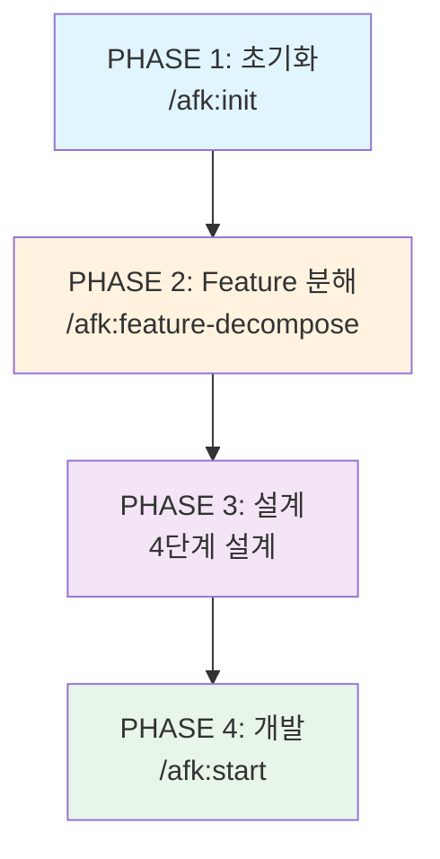

# AFK

AI-augmented Feature development Kit - AI와 함께 소프트웨어 프로젝트를 체계적으로 개발하는 Claude Code 플러그인입니다.

## 개요

AFK는 **4단계 워크플로우**를 지원하는 플러그인으로, 프로젝트 초기화부터 개발까지 AI와 함께 진행합니다.

## 4단계 워크플로우



| 단계 | 명령어 | 설명 |
|------|--------|------|
| PHASE 1 | `/afk:init` | 프로젝트 초기화 |
| PHASE 2 | `/afk:feature-decompose` | 4단계 Feature 분해 (아키텍처, 디자인, 환경, Task) |
| PHASE 3 | (분해 과정에서 자동 진행) | 4단계 설계 완료 |
| PHASE 4 | `/afk:start <task-id>` | TDD 사이클 (RED → GREEN → REFACTOR) |

## 빠른 시작

### 1. 플러그인 설치


**마켓플레이스에서 설치:**

```bash
# 1. 마켓플레이스 추가
/plugin marketplace add https://github.com/robinseo/afk-mod

# 2. 플러그인 설치
/plugin install afk

# 3. 설치 확인
/help
```

**팀 프로젝트에서 자동 설치:**

저장소의 `.claude/settings.json`에 추가:

```json
{
  "plugins": [
    {
      "name": "afk",
      "marketplace": "https://github.com/robinseo/afk-mod"
    }
  ]
}
```

### 2. 프로젝트 초기화

```bash
/afk:init
```

프로젝트 정보를 입력하면 `.afk-mod/` 디렉토리가 생성됩니다.

### 3. Feature List 준비

feature-list.csv를 `.afk-mod/`에 복사합니다:

```bash
cp your-feature-list.csv .afk-mod/feature-list.csv
```

**CSV 형식:**

```csv
id,parent,title,description,acceptance_criteria
1,,이슈 관리,이슈를 생성하고 관리할 수 있다,"AC1: 이슈 생성 가능|AC2: 이슈 수정 가능"
1.1,1,이슈 CRUD,이슈의 기본 CRUD 기능,"AC1: 생성|AC2: 조회|AC3: 수정|AC4: 삭제"
1.1.1,1.1,이슈 생성,제목과 설명으로 이슈를 생성할 수 있다,"AC1: 제목 필수|AC2: 설명 필수"
```

### 4. Feature 분해

```bash
/afk:feature-decompose
```

4단계 프로세스가 진행됩니다:

1. **아키텍처 설계** - 데이터베이스, API, 배포 환경 등
2. **디자인 설계** - 디자인 시스템, 다크 모드, 모바일 지원 등
3. **환경설정** - 언어, 프레임워크, 테스트 도구 등
4. **Task 분해** - Feature를 fine-grained Task로 분해

### 5. 개발 시작

```bash
/afk:start 1.1.1
```

TDD 사이클이 자동으로 실행됩니다:


## 명령어 목록

| 명령어 | 설명 |
|--------|------|
| `/afk:init` | 프로젝트 초기화 |
| `/afk:feature-decompose` | 4단계 Feature 분해 |
| `/afk:start <task-id>` | TDD 사이클 시작 |
| `/afk:checkin` | 중단 후 재개 시 상태 파악 |
| `/afk:task` | Task 목록 관리 |
| `/afk:reload` | Feature List 갱신 |

## 사용 예시

````
# 1. 프로젝트 초기화
/afk:init

# 2. Feature List 복사
cp feature-list.csv .afk-mod/

# 3. Feature 분해
/afk:feature-decompose

# 4. 개발 시작
/afk:start 1.1.1

# 5. 작업 중단 후 재개
/afk:checkin
````

## 세션 재개

중간에 작업을 중단했다가 다시 돌아올 때:

````
/afk:checkin

👋 다시 오셨군요!

## 📊 현재 작업 중
### Task 1.1.1: 로그인 폼 UI 구현
**TDD Phase**: 🔄 REFACTOR 진행 중

## 🚀 다음 단계
1. 계속하기 - REFACTOR 완료
2. 검토하기 - 현재 코드 확인
````

## 파일 구조

```
afk-mod/
├── .claude-plugin/              # 플러그인 설정
│   ├── plugin.json              # 플러그인 정보
│   ├── marketplace.json         # 마켓플레이스 정보
│   └── hooks.json               # 워크플로우 강제 Hook
├── .afk-mod/                    # 작업 디렉토리 (프로젝트마다 생성)
│   ├── project-info.json        # 프로젝트 기본 정보
│   ├── feature-list.csv         # Feature List
│   ├── state.json               # 워크플로우 상태
│   ├── architecture-design.md   # 아키텍처 설계
│   ├── design-design.md         # 디자인 설계
│   ├── environment-setup.md     # 환경설정
│   └── tasks/                   # Task 저장소
│       ├── task-groups.json     # 전체 Task 그룹 구조
│       └── tg-*.json            # 각 Task 그룹별 상세 Task
├── commands/                    # 명령어 정의
├── agents/                      # 에이전트 정의
├── skills/                      # 스킬 정의
└── docs/                        # 상세 문서
```

## TDD 사이클

| 단계 | 명령어 | 출력 | Gate |
|------|--------|------|------|
| **RED** | `/afk:start` | 테스트 파일 (실패) | - |
| **GREEN** | (자동 진행) | 최소 구현 (통과) | - |
| **REFACTOR** | (자동 진행) | 코드 정리 (통과 유지) | - |

## 상세 문서

- [설치 및 시작하기](docs/getting-started.md)
- [명령어 상세 가이드](docs/commands.md)
- [워크플로우 상세](docs/workflow.md)
- [Feature List 형식](docs/feature-list-format.md)

## 라이선스

MIT
