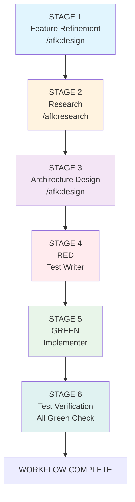
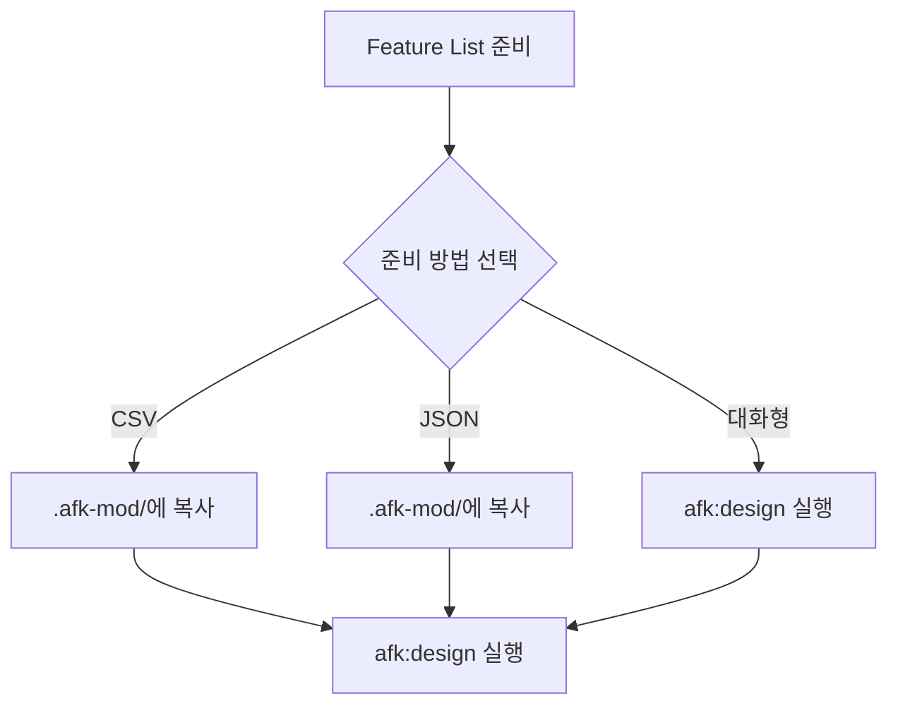

# AFK-Mod

AI와 함께 소프트웨어 프로젝트를 체계적으로 개발하는 Claude Code 플러그인입니다.

## 개요

AFK-Mod는 **6단계 TDD 워크플로우**를 지원하는 플러그인으로, 프로젝트 설계부터 개발까지 AI 에이전트와 함께 진행합니다.

## 6단계 TDD 워크플로우



| 단계 | 명령어 | 설명 |
|------|--------|------|
| STAGE 1 | `/afk:design` | 수락기준(AC) 포함 피처 명세서 작성 |
| STAGE 2 | `/afk:research <id>` | 프로젝트 구조 & 코드 패턴 분석 |
| STAGE 3 | `/afk:design` | 아키텍처 & 기술 스택 결정 |
| STAGE 4~6 | `/afk:start <id>` | RED → GREEN → Test Verification 자동화 |

## 빠른 시작

### 1. 플러그인 설치

**로컬 플러그인으로 설치:**

```bash
# 방법 1: 플러그인 디렉토리로 Claude Code 실행
cd /path/to/your-project
claude --plugin-dir /Users/robin/repos/afk-mod

# 방법 2: 전역 설치 (선택)
mkdir -p ~/.claude/plugins
cp -r /Users/robin/repos/afk-mod ~/.claude/plugins/afk-mod

# 방법 3: 심볼릭 링크 (권장 - 개발 중 업데이트 즉시 반영)
ln -s /Users/robin/repos/afk-mod ~/.claude/plugins/afk-mod
```

**Claude Code 설정 파일에 추가 (선택):**

```json
{
  "plugins": [
    {
      "name": "afk-mod",
      "path": "/Users/robin/repos/afk-mod"
    }
  ]
}
```

### 2. 플러그인 확인

```bash
# /help로 명령어가 나타나는지 확인
/help
```

다음 명령어들이 표시되어야 합니다:
- `/afk:checkin` - 중단된 작업 재개
- `/afk:design` - 프로젝트 설계
- `/afk:feature-list` - Feature 목록 관리
- `/afk:research <id>` - 프로젝트 구조 분석
- `/afk:start <id>` - TDD 사이클 시작
- `/afk:task` - Task 목록 관리
- `/afk:reload` - Feature List 갱신
- `/afk:extract` - 코드베이스에서 Feature 추출

### 2. Feature List 준비



**방법 1: CSV 파일**

```bash
cp your-feature-list.csv .afk-mod/feature-list.csv
```

**방법 2: JSON 파일**

```bash
cp your-feature-list.json .afk-mod/feature-list.json
```

**방법 3: 대화형 생성**

```
/afk:design
# 클로드코드와 대화로 Feature List 작성
```

### 3. 프로젝트 설계

```
/afk:design
```

### 4. Feature 개발

```
/afk:research 1.1.1    # 리서치 (프로젝트 구조/코드 패턴 분석)
/afk:start 1.1.1      # TDD 사이클 시작 (RED → GREEN → Verification)
/afk:checkin           # 중단 후 재개 시 현재 상황 파악
```

## 명령어 목록

| 명령어 | 설명 |
|--------|------|
| `/afk:design` | 프로젝트 설계 (STAGE 1 & 3) |
| `/afk:research <id>` | 프로젝트 구조 & 코드 패턴 분석 (STAGE 2) |
| `/afk:checkin` | 중단 후 재개 시 현재 상황 파악 |
| `/afk:feature-list` | Feature 목록 표시 |
| `/afk:start <id>` | TDD 사이클 시작 (STAGE 4~6) |
| `/afk:task` | Task 목록 관리 |
| `/afk:reload` | Feature List 갱신 |
| `/afk:extract` | 코드베이스에서 Feature 추출 |

## 사용 예시

```
# 1. 프로젝트 설계
/afk:design

# 2. Feature 분석
/afk:research 1.1.1

# 3. 개발 시작
/afk:start 1.1.1

# 4. 작업 중단 후 재개
/afk:checkin
```

## 세션 재개

중간에 작업을 중단했다가 다시 돌아올 때:

```
/afk:checkin

👋 다시 오셨군요!

## 📊 현재 작업 중
### Feature 1.1.1: 이슈 생성
**Task 1**: REFACTOR 진행 중

## 🚀 다음 단계
1. 계속하기 - REFACTOR 완료
2. 검토하기 - 현재 코드 확인
```

## 상세 문서

- [설치 및 시작하기](docs/getting-started.md)
- [명령어 상세 가이드](docs/commands.md)
- [워크플로우 상세](docs/workflow.md)
- [Feature List 형식](docs/feature-list-format.md)

## 파일 구조

```
afk-mod/
├── sample-feature-list.csv      # 샘플 CSV
├── sample-feature-list.json     # 샘플 JSON
├── .claude-plugin/              # 플러그인 설정
│   ├── plugin.json              # 명령어/에이전트 정의
│   └── marketplace.json         # 마켓플레이스 정보
├── .afk-mod/                    # 작업 디렉토리
│   ├── feature-list.json        # Feature List (JSON)
│   ├── feature-list.csv         # Feature List (CSV)
│   ├── project-design.json      # 프로젝트 설계
│   └── state.json               # 상태 관리
├── commands/                    # 명령어 정의
├── agents/                      # 에이전트 정의
├── skills/                      # 스킬 정의
└── docs/                        # 상세 문서
```

## 6단계 TDD 사이클

| 단계 | 명령어 | 출력 | Gate |
|------|--------|------|------|
| **STAGE 1** | `/afk:design` | AC 포함 피처 명세서 | 사용자 승인 |
| **STAGE 2** | `/afk:research` | 리서치 보고서 | - |
| **STAGE 3** | `/afk:design` | 아키텍처 옵션 | 사용자 선택 |
| **STAGE 4** | `/afk:start` | 테스트 파일 (RED) | - |
| **STAGE 5** | `/afk:start` | 최소 구현 (GREEN) | - |
| **STAGE 6** | `/afk:start` | 전체 테스트 검증 | - |

## 라이선스

MIT
