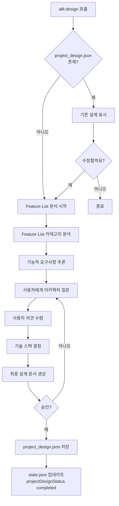
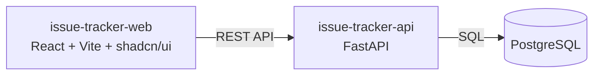
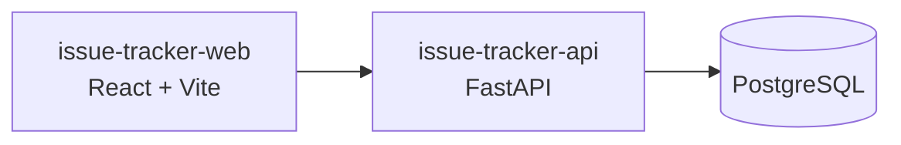

# /afk:design

프로젝트 설계를 수행하는 가장 첫 번째 명령어입니다. Feature List를 분석하여 아키텍처와 기술 스택을 결정합니다.

## 사용자 플로우

AFK-Mod 플러그인 설치 후 다음 3가지 방법으로 Feature List를 준비할 수 있습니다:

1. **CSV 가져오기**: 기존 `feature-list.csv`를 `.afk-mod/`에 복사
2. **JSON 가져오기**: 기존 `feature-list.json`를 `.afk-mod/`에 복사
3. **대화형 생성**: 클로드코드와 대화하여 `feature-list.json`을 처음부터 작성

그 후 `/afk:design`을 실행하여 프로젝트 설계를 시작합니다.

## 전제 조건

- `.afk-mod/feature-list.json` 또는 `sample-feature-list.json` 파일이 존재해야 합니다
- 프로젝트 설계가 완료되지 않은 상태(`state.json.projectDesignStatus != "completed"`)여야 합니다

## 동작

### 흐름도



### 1단계: Feature List 분석

```
클로드코드> 프로젝트 설계를 시작합니다.

## Step 1: Feature List 분석

sample-feature-list.json를 분석 중...

### 발견된 카테고리
1. 이슈 관리 (1.x)
   - 이슈 CRUD
   - 상태 관리
   - 태그 관리
   - 우선순위 관리

2. 스프린트 관리 (2.x)
   - 스프린트 CRUD
   - 이슈 할당
   - 진행 추적
   - 스프린트 제어

3. 보드 뷰 (3.x)
   - 칸반 보드
   - 드래그앤드롭
   - Swim Lane
   - 필터

4. 대시보드 (4.x)
   - 팀 대시보드
   - 개인 대시보드

5. 알림 (5.x)
   - 알림 생성
   - 알림 조회

### 추론되는 기능적 요구사항
- CRUD 작업 (이슈/스프린트 생성/수정/삭제)
- 실시간 업데이트 (상태 변경, 알림)
- 복잡한 UI (칸반 보드, 드래그앤드롭, 대시보드)
- 데이터 시각화 (진행률, 차트)
- 협업 기능 (담당자 할당, 알림)
```

### 2단계: 아키텍처 제안

```
클로드코드> 위 분석을 바탕으로 아키텍처를 제안합니다.

## Step 2: 아키텍처 결정

### 옵션 A: 2-tier (추천)

Frontend (Web) --> Backend (API) --> Database

- 장점: 간단한 구조, API 독립적, 보안 안전
- 단점: Backend 서버 필수
- 적합한 경우: 일반적인 웹 애플리케이션

### 옵션 B: 1-tier (Frontend only)

Frontend (Web) --> Database (BaaS like Supabase)

- 장점: 더 간단한 구조, 서버 비용 절감
- 단점: 비즈니스 로직이 Frontend에 노출
- 적합한 경우: 프로토타입, 소규모 팀

### 옵션 C: 3-tier

Frontend --> API Gateway --> Service --> Database

- 장점: 확장성 우수, 마이크로서비스로 전환 용이
- 단점: 초기 설정 복잡, Overkill 가능성
- 적합한 경우: 대규모 서비스, 팀 협업

어떤 구조를 선호하시나요?
(번호 입력: 1, 2, 3 또는 직접 설명)

사용자> 1

클로드코드> 2-tier 아키텍처로 진행합니다.
```

### 3단계: 기술 스택 결정

```
클로드코드> 기술 스택을 결정합니다.

## Step 3: Frontend 기술 스택

Feature 분석 결과:
- 복잡한 Form (이슈/스프린트 생성/수정)
- 실시간 업데이트 (상태 변경, 알림)
- 드래그앤드롭 (칸반 보드)
- 데이터 시각화 (진행률, 차트, 대시보드)

다음 중 어떤 방향을 선호하시나요?

1. **React + Vite** (빠름, 표준, 생태계 풍부) ⭐ 추천
2. **Next.js** (SSR 필요 시, full-stack 프레임워크)
3. **Vue 3 + Vite** (간결한 문법, 빠른 학습 곡선)
4. **SvelteKit** (가볍고 빠름)
5. 다른 (직접 입력)

사용자> 1

클로드코드> React + Vite로 선택합니다.

### Frontend 세부 설정

UI 라이브러리를 선택하세요:

1. **shadcn/ui** (⭐ 추천: Radix UI 기반, 완전한 커스터마이징)
2. **Material-UI** (인기 많음, 디자인 시스템 완비)
3. **Chakra UI** (간편한 사용, 접근성 기본)
4. **Tailwind CSS only** (완전 자유 디자인)
5. 다른 (직접 입력)

사용자> 1

클로드코드> shadcn/ui를 사용합니다.

---

## Step 4: Backend 기술 스택

데이터베이스와 API 프레임워크를 선택하세요.

1. **FastAPI + PostgreSQL** (⭐ 추천: 빠른 API 개발, 관계형 DB)
2. **Next.js Route Handlers + Prisma** (Frontend와 동일 스택, 간편)
3. **Express + Node.js + MongoDB** (JavaScript 풀스택)
4. 다른 (직접 입력)

사용자> 1

클로드코드> FastAPI + PostgreSQL으로 선택합니다.
```

### 4단계: 최종 설계 확인

```
클로드코드> 위 분석을 바탕으로 최종 설계를 제안합니다.

## 최종 설계 확인

### Architecture



### 프로젝트 구조

issue-tracker/
├── web/                    # Frontend (React + Vite)
│   ├── src/
│   │   ├── components/     # shadcn/ui 컴포넌트
│   │   ├── pages/          # 페이지별 컴포넌트
│   │   ├── lib/            # 유틸리티, API 클라이언트
│   │   └── hooks/          # React Hooks
│   ├── package.json
│   └── vite.config.ts
├── api/                    # Backend (FastAPI)
│   ├── app/
│   │   ├── api/            # API 라우터
│   │   ├── models/         # 데이터 모델
│   │   ├── services/       # 비즈니스 로직
│   │   └── main.py         # FastAPI 앱 진입점
│   ├── requirements.txt
│   └── pyproject.toml
└── afk-mod/              # AFK-Mod 플러그인 데이터
    ├── project-design.json # 이 설계 문서
    ├── feature-list.csv
    ├── state.json
    └── features/           # Feature별 문서

### 기술 스택

| 계층 | 기술 | 설명 |
|------|------|------|
| Frontend Framework | React 18 + Vite | 빠른 빌드, HMR |
| UI Library | shadcn/ui | Radix UI 기반, 완전 커스터마이징 |
| Drag & Drop | @dnd-kit/core | 칸반 보드 드래그앤드롭 |
| Charts | Recharts | 대시보드 차트 |
| Styling | Tailwind CSS | 유틸리티 퍼스트 |
| Backend Framework | FastAPI | 빠른 API 개발, 타입 힌트 |
| Language | Python 3.11+ | 비동기 처리 지원 |
| Database | PostgreSQL 15+ | 관계형 DB, JSON 지원 |
| ORM | SQLAlchemy | Python SQL 툴킷 |
| State Management | React Query + Zustand | 서버 상태 + 클라이언트 상태 |

### 주요 의사결정 (ADR)

| ID | 결정 | 내용 |
|----|------|------|
| arch-001 | 2-tier 아키텍처 | Frontend와 Backend를 분리 |
| tech-001 | React + Vite | 빠른 개발 속도와 넓은 생태계 |
| tech-002 | shadcn/ui | 완전한 커스터마이징 가능한 Radix UI 기반 |
| tech-003 | FastAPI + PostgreSQL | 빠른 API 개발, 안정적인 관계형 DB |
| tech-004 | @dnd-kit/core | 칸반 보드 드래그앤드롭 |

이 설계를 저장하시겠습니까?
1. **Accept** - 저장하고 Feature 개발 시작 가능
2. **수정** - 다시 설계

사용자> 1

클로드코드> 프로젝트 설계를 저장했습니다.

- .afk-mod/project-design.json 생성 완료
- .afk-mod/state.json 업데이트 (projectDesignStatus: completed)

이제 /afk:feature-list로 Feature를 확인하고, /afk:start로 개발을 시작할 수 있습니다!
```

## 설계 수정 (이미 설계가 있는 경우)

```
사용자> /afk:design

클로드코드> 프로젝트 설계가 이미 존재합니다.

## 현재 설계



### 기술 스택
- Frontend: React + Vite + shadcn/ui
- Backend: FastAPI + Python + PostgreSQL

설계를 수정하시겠습니까?
1. 아니오 - 현재 설계 유지
2. 예 - 다시 설계

사용자> 2

클로드코드> 설계를 다시 시작합니다...
[새로운 설계 프로세스 시작]
```

## /afk:start 실행 전 체크

```
사용자> /afk:start 1.1.1

클로드코드> 프로젝트 설계가 완료되지 않았습니다.
먼저 /afk:design으로 프로젝트를 설계해주세요.

(Hint: project-design.json이 존재하고, state.json.projectDesignStatus가 "completed"여야 합니다)
```

## state.json 업데이트

### 설계 시작 시

```json
{
  "projectDesignStatus": "in_progress",
  "lastUpdated": "2025-02-02T10:00:00Z"
}
```

### 설계 완료 시

```json
{
  "projectDesignStatus": "completed",
  "lastUpdated": "2025-02-02T12:00:00Z"
}
```

## project-design.json 스키마

```json
{
  "project": {
    "name": "Issue Tracker",
    "description": "팀 내 이슈 트래커 애플리케이션",
    "version": "0.1.0",
    "createdAt": "2025-02-02T10:00:00Z",
    "updatedAt": "2025-02-02T12:00:00Z"
  },
  "architecture": {
    "type": "client-server",
    "description": "2-tier: Frontend + Backend + Database",
    "layers": [
      {
        "name": "frontend",
        "type": "web-client",
        "description": "사용자 인터페이스",
        "tech": ["React", "Vite", "shadcn/ui", "Tailwind CSS"],
        "directory": "./web"
      },
      {
        "name": "backend",
        "type": "api-server",
        "description": "API 및 비즈니스 로직",
        "tech": ["FastAPI", "Python 3.11+"],
        "directory": "./api"
      },
      {
        "name": "database",
        "type": "database",
        "description": "데이터 저장소",
        "tech": ["PostgreSQL 15+"],
        "url": "postgresql://localhost:5432/issue_tracker"
      }
    ]
  },
  "techStack": {
    "frontend": {
      "framework": "react",
      "bundler": "vite",
      "language": "typescript",
      "uiLibrary": "shadcn/ui",
      "styling": "tailwindcss",
      "directory": "./web"
    },
    "backend": {
      "framework": "fastapi",
      "language": "python",
      "version": "3.11+",
      "orm": "sqlalchemy",
      "directory": "./api"
    }
  },
  "decisions": [
    {
      "id": "arch-001",
      "title": "2-tier 아키텍처 선택",
      "context": "Frontend + Backend + Database",
      "decision": "Frontend와 Backend를 분리",
      "consequences": [
        "Frontend는 비즈니스 로직 없이 UI만 담당",
        "모든 데이터 접근은 Backend API 통해 진행",
        "보안: 인증/인가가 Backend에서 처리"
      ],
      "timestamp": "2025-02-02T10:00:00Z"
    },
    {
      "id": "tech-001",
      "title": "React + Vite 선택",
      "context": "빠른 개발 속도와 넓은 생태계 필요",
      "decision": "React 18 + Vite로 빌드 도구 선택",
      "consequences": [
        "빠른 HMR (Hot Module Replacement)",
        "넓은 라이브러리 생태계",
        "Next.js로 마이그레이션 용이"
      ],
      "timestamp": "2025-02-02T10:30:00Z"
    },
    {
      "id": "tech-002",
      "title": "shadcn/ui 선택",
      "context": "완전한 커스터마이징 가능한 UI 라이브러리 필요",
      "decision": "shadcn/ui (Radix UI 기반) 사용",
      "consequences": [
        "컴포넌트를 프로젝트로 직접 복사하여 소유",
        "완전한 스타일 커스터마이징 가능",
        "TypeScript 친화적"
      ],
      "timestamp": "2025-02-02T10:45:00Z"
    },
    {
      "id": "tech-003",
      "title": "FastAPI + PostgreSQL 선택",
      "context": "빠른 API 개발과 안정적인 데이터 저장 필요",
      "decision": "FastAPI + Python 3.11+ + PostgreSQL 15+",
      "consequences": [
        "빠른 비동기 API 개발",
        "자동 API 문서 생성 (Swagger UI)",
        "안정적인 관계형 데이터 저장"
      ],
      "timestamp": "2025-02-02T11:00:00Z"
    }
  ]
}
```

## 에이전트 참조

UX Designer, CTO, Researcher Agent는 `/afk:start` 실행 시 `project-design.json`의 내용을 참조하여 설계/아키텍처 문서를 작성합니다:

- **UX Designer**: `project-design.architecture.layers[].tech` (UI 라이브러리 등)
- **CTO**: `project-design.architecture`, `project-design.techStack`
- **Researcher**: `project-design.techStack.backend.orm` 등 기술 스택 기반 리서치

## Feature 파일 경로

우선순위:
1. `.afk-mod/feature-list.json` (사용자가 생성한 JSON Feature List)
2. `.afk-mod/feature-list.csv` (사용자가 생성한 CSV Feature List)
3. `sample-feature-list.json` (프로젝트 루트의 JSON 샘플)
4. `sample-feature-list.csv` (프로젝트 루트의 CSV 샘플)
5. 사용자가 직접 지정한 경로: `/afk:design --file=/path/to/feature-list.json`

---

## CSV → JSON 변환

사용자가 CSV 파일을 업로드하는 경우 자동으로 JSON으로 변환합니다.

### 변환 로직

```
클로드코드> CSV 파일을 감지했습니다. JSON으로 변환합니다.

## 변환 중...

### 1단계: CSV 파싱
- 행 수: 50
- 열 수: 9

### 2단계: parent_id 자동 추론
- "1.1.1" → parent_id: "1.1"
- "1.1" → parent_id: "1"
- "1" → parent_id: null

### 3단계: JSON 생성
.afk-mod/feature-list.json에 50개의 Feature를 변환했습니다.

## 변환 결과

| 변경 전 (CSV) | 변경 후 (JSON) |
|--------------|----------------|
| Depth1 | category (제거됨, parent_id로 대체) |
| Depth2 | subcategory (제거됨, parent_id로 대체) |
| Depth3 | module (제거됨, parent_id로 대체) |
| 넘버링 | id |
| 설명 | title |
| User Action | userAction |
| System Outcome | systemOutcome |
| Dependencies | 제거됨 (parent_id로 표현) |
| Acceptance Criteria | acceptanceCriteria (array) |
```

---

## 대화형 Feature List 생성

Feature List 파일이 없는 경우, 대화형으로 Feature 목록을 생성할 수 있습니다.

### 대화형 생성 흐름

```
사용자> /afk:design

클로드코드> Feature List 파일을 찾을 수 없습니다.
새로운 Feature List를 만들까요?

1. 예 - 대화형으로 생성 시작
2. 아니오 - 기존 파일 지정
3. 샘플 사용 - sample-feature-list.json 복사

사용자> 1

클로드코드> Feature List 대화형 생성을 시작합니다.

---

## Step 1: 프로젝트 정보 입력

프로젝트 이름을 입력하세요:
사용자> 이슈 트래커

프로젝트 설명을 입력하세요:
사용자> 팀 내 이슈를 관리하는 웹 애플리케이션

---

## Step 2: 최상위 Feature 카테고리 추가

최상위 Feature 카테고리를 추가합니다.

카테고리 ID (예: 1):
사용자> 1

카테고리 이름 (예: 이슈 관리):
사용자> 이슈 관리

설명 (선택):
사용자> 이슈 생성, 조회, 수정, 삭제 기능

✅ Feature 1: 이슈 관리 추가됨

더 추가하시겠습니까? (y/n):
사용자> y

[반복...]

---

## Step 3: 하위 Feature 추가

상위 Feature를 선택하여 하위 Feature를 추가합니다.

상위 Feature ID:
사용자> 1

하위 Feature ID (예: 1.1):
사용자> 1.1

Feature 이름:
사용자> 이슈 CRUD

설명 (선택):
사용자> 이슈 기본 CRUD 기능

✅ Feature 1.1: 이슈 CRUD 추가됨 (parent_id: 1)

더 추가하시겠습니까? (y/n):
사용자> y

[반복...]

---

## Step 4: 상세 Feature 추가 (Leaf Node)

User Action, System Outcome, Acceptance Criteria를 입력합니다.

상위 Feature ID:
사용자> 1.1

하위 Feature ID (예: 1.1.1):
사용자> 1.1.1

Feature 이름:
사용자> 이슈 생성

User Action (Given):
사용자> 사용자가 "새 이슈"에서 제목/설명/우선순위/담당자를 입력 후 저장한다

System Outcome (Then):
사용자> 새 이슈가 생성되고 목록에 추가된다

Acceptance Criteria (쉼표로 구분):
사용자> 제목 중복 허용, 필수 항목(제목, 설명) 검증, 저장 성공 시 목록/상세로 이동, 실패 시 원인 메시지 표시

✅ Feature 1.1.1: 이슈 생성 추가됨 (parent_id: 1.1)

더 추가하시겠습니까? (y/n):
사용자> n

---

## Step 5: 저장 확인

생성된 Feature List를 확인합니다.

| ID | Title | Parent | Details |
|----|-------|--------|---------|
| 1 | 이슈 관리 | - | 설명만 있음 |
| 1.1 | 이슈 CRUD | 1 | 설명만 있음 |
| 1.1.1 | 이슈 생성 | 1.1 | userAction, systemOutcome, acceptanceCriteria 있음 |
| 1.1.2 | 이슈 목록 조회 | 1.1 | [추가 필요] |
...

저장하시겠습니까?
1. Yes - .afk-mod/feature-list.json에 저장
2. No - 계속 추가
3. Cancel - 취소

사용자> 1

✅ .afk-mod/feature-list.json에 3개의 Feature를 저장했습니다.
이제 프로젝트 설계를 시작합니다...
[기존 설계 프로세스 계속]
```

### JSON 스키마

```json
{
  "$schema": "http://json-schema.org/draft-07/schema#",
  "type": "object",
  "required": ["version", "features"],
  "properties": {
    "version": {
      "type": "string",
      "description": "Feature List 포맷 버전"
    },
    "metadata": {
      "type": "object",
      "properties": {
        "projectName": { "type": "string" },
        "description": { "type": "string" },
        "createdAt": { "type": "string", "format": "date-time" },
        "updatedAt": { "type": "string", "format": "date-time" }
      }
    },
    "features": {
      "type": "array",
      "items": {
        "type": "object",
        "required": ["id", "title", "parent_id"],
        "properties": {
          "id": { "type": "string" },
          "title": { "type": "string" },
          "parent_id": { "type": ["string", "null"] },
          "description": { "type": "string" },
          "userAction": { "type": "string" },
          "systemOutcome": { "type": "string" },
          "acceptanceCriteria": {
            "type": "array",
            "items": { "type": "string" }
          }
        }
      }
    }
  }
}
```
