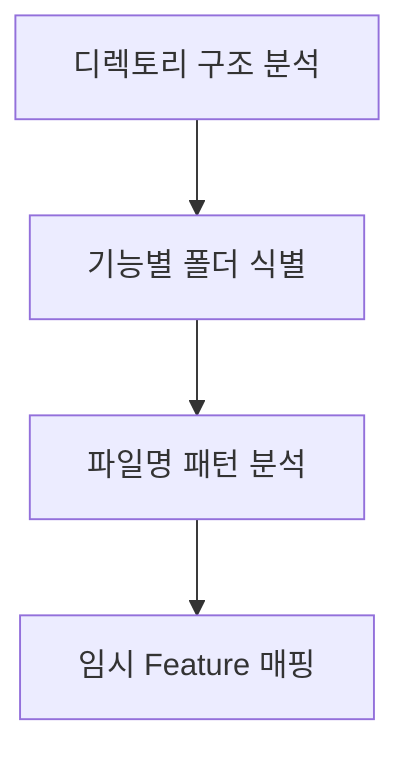

# /afk:extract

기존 코드베이스를 분석하여 Feature List를 추출합니다. (시나리오 5)

## 동작

### 1단계: 파일 시스템 분석



- 프로젝트 루트부터 디렉토리 구조 분석
- 컴포넌트/모듈/서비스별 폴더 식별
- 파일명 패턴으로 기능 추론 (예: `*Issue*.tsx` → 이슈 관리)

### 2단계: Git 히스토리 분석

- 최근 commit 메시지 분석
- 변경된 파일 패턴으로 기능 추론
- 커밋 빈도로 활성/비활성 Feature 판단

### 3단계: 코드 내용 분석 (선택)

- 함수/클래스 이름 분석
- 주석에서 기능 추론
- Import/Export 관계로 의존성 파악

### 4단계: Human-in-the-Loop 검증

```
사용자> /afk:extract

클로드코드> 코드베이스를 분석하여 Feature List를 추출합니다...

## 1단계: 파일 시스템 분석 완료

다음 구조를 발견했습니다:
\```
src/
├── issues/           # 이슈 관리
│   ├── IssueList.tsx
│   ├── IssueDetail.tsx
│   ├── IssueEditor.tsx
│   └── IssueForm.tsx
├── sprints/          # 스프린트 관리
│   ├── SprintList.tsx
│   ├── SprintDetail.tsx
│   └── SprintSettings.tsx
├── board/            # 칸반 보드
│   ├── KanbanBoard.tsx
│   ├── IssueCard.tsx
│   └── DragDrop.tsx
├── dashboard/        # 대시보드
│   ├── TeamDashboard.tsx
│   └── MyDashboard.tsx
└── lib/
    └── api.ts        # Backend 연동
\```

## 2단계: Git 히스토리 분석 완료

최근 100개 커밋을 분석했습니다.

## 추정된 Feature List

### 1. 이슈 관리
- 1.1 이슈 CRUD
- 1.2 이슈 상태 관리
- 1.3 이슈 태그 관리
- 1.4 이슈 우선순위 관리

### 2. 스프린트 관리
- 2.1 스프린트 CRUD
- 2.2 이슈 할당
- 2.3 진행 추적
- 2.4 스프린트 제어

### 3. 보드 뷰
- 3.1 칸반 보드
- 3.2 Swim Lane

### 4. 대시보드
- 4.1 팀 대시보드
- 4.2 개인 대시보드

### 5. 알림
- 5.1 알림 생성
- 5.2 알림 조회

이 분석이 정확한지 검증해주세요. 수정이 필요한 항목을 말씀해 주세요.

1. 계속 진행
2. 특정 항목 수정
3. 분석 재시행
```

### 5단계: 상세 분석 및 검증

사용자 피드백을 반영하여 반복적으로 정제

### 6단계: JSON 생성

```
클로드코드> 검증이 완료되었습니다. Feature List를 생성합니다.

.afk-mod/feature-list.json에 50개의 Feature를 저장했습니다.
.afk-mod/state.json을 초기화했습니다.

이제 /afk:feature-list로 확인하고, /afk:start로 개발을 시작할 수 있습니다.
```

## 옵션

- `/afk:extract --depth=quick` - 빠른 분석 (파일 시스템만)
- `/afk:extract --depth=full` - 상세 분석 (코드 내용 포함)
- `/afk:extract --commits=200` - 분석할 커밋 수 지정
