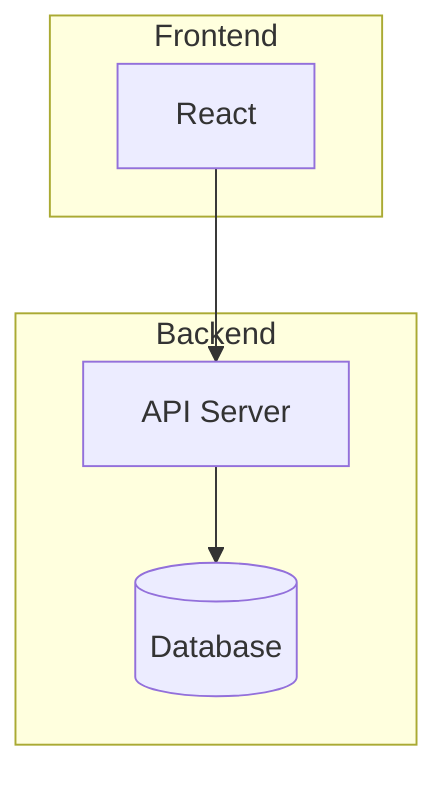

# Feature 분해 (/afk:feature-decompose)

Feature를 Task 단위로 완전 분해하는 4단계 프로세스를 실행합니다.

## 전제 조건 확인

먼저 다음을 확인하세요:

1. `.afk-mod/` 디렉토리가 존재하는가?
2. `.afk-mod/feature-list.csv`가 존재하는가?

둘 중 하나라도 없으면 사용자에게 `/afk:init`을 먼저 실행하라고 안내하세요.

---

## 1단계: 아키텍처 설계

프로젝트의 기술 아키텍처를 설계합니다. **사용자와 핑퐁**하면서 결정하세요.

### 질문할 항목

1. **데이터베이스**: 어떤 DB를 사용할까요? (PostgreSQL, MySQL, MongoDB, SQLite, etc.)
2. **실시간 기능**: WebSocket/SSE 등 실시간 기능이 필요한가요?
3. **인증/인가**: 인증 방식이 필요한가요? (JWT, OAuth, Session, etc.)
4. **API 스타일**: REST API, GraphQL, tRPC?
5. **배포 환경**: 어디에 배포할 예정인가요? (Vercel, AWS, Docker, etc.)
6. **외부 서비스**: 사용할 외부 API나 서비스가 있나요?
7. **아키텍처 패턴**: Monolith, Microservices, Serverless?

### 결과물 생성

`.afk-mod/architecture-design.md`에 결정된 아키텍처를 저장하세요:

```markdown
# [프로젝트명] 아키텍처 설계

## 개요
[프로젝트에 대한 간단한 설명]

## 기술 스택 결정사항

### 데이터베이스
- **선택**: [결정]
- **이유**: [이유]

### 인증/인가
- **선택**: [결정]
- **이유**: [이유]

### API 스타일
- **선택**: [결정]
- **이유**: [이유]

### 배포 환경
- **선택**: [결정]
- **이유**: [이유]

## 아키텍처 다이어그램



## 주요 설계 결정
- [결정사항 1]
- [결정사항 2]
```

### 상태 업데이트

`state.json`을 업데이트하세요:

```json
{
  "stages": {
    "architecture": { "status": "completed", "artifact": "architecture-design.md" }
  },
  "workflow": "feature_decompose_in_progress",
  "currentStage": "architecture_completed"
}
```

---

## 2단계: 디자인 설계

UI/UX 디자인을 설계합니다. **사용자와 핑퐁**하면서 결정하세요.

### 질문할 항목

1. **디자인 시스템**: 사용할 디자인 시스템이나 UI 라이브러리가 있나요? (shadcn/ui, Chakra UI, Material UI, Tailwind CSS, etc.)
2. **다크 모드**: 다크 모드를 지원할까요?
3. **모바일 지원**: 반응형 디자인이 필요한가요? PWA로 만들까요?
4. **색상 테마**: 브랜드 색상이나 선호하는 색상이 있나요?
5. **레이아웃 스타일**: 사이드바, 탭, 카드 등 선호하는 레이아웃 패턴이 있나요?
6. **애니메이션**: 애니메이션/트랜지션을 얼마나 사용할까요?

### 결과물 생성

`.afk-mod/design-design.md`에 결정된 디자인을 저장하세요:

```markdown
# [프로젝트명] 디자인 설계

## 디자인 시스템

### UI 라이브러리
- **선택**: [결정]
- **이유**: [이유]

### 스타일링 접근법
- **선택**: [Tailwind CSS / CSS Modules / Styled Components / etc.]
- **이유**: [이유]

## 테마

### 색상
- **Primary**: [색상 코드]
- **Secondary**: [색상 코드]
- **Accent**: [색상 코드]

### 타이포그래피
- **폰트**: [폰트명]
- **스케일**: [설명]

## 다크 모드
- **지원 여부**: [Yes/No]
- **구현 방식**: [방법 설명]

## 레이아웃 패턴

### 공통 레이아웃
- [레이아웃 구조 설명]

### 반응형 디자인
- [브레이크포인트 등 설명]

## 주요 UI 컴포넌트
- [핵심 컴포넌트 목록]
```

### 상태 업데이트

`state.json`을 업데이트하세요:

```json
{
  "stages": {
    "architecture": { "status": "completed", "artifact": "architecture-design.md" },
    "design": { "status": "completed", "artifact": "design-design.md" }
  },
  "workflow": "feature_decompose_in_progress",
  "currentStage": "design_completed"
}
```

---

## 3단계: 환경설정

개발 환경을 설정합니다. **사용자와 핑퐁**하면서 결정하세요.

### 질문할 항목

1. **언어**: TypeScript, JavaScript, Python, etc.?
2. **프레임워크**: React, Next.js, Vue, Svelte, Express, FastAPI, etc.?
3. **패키지 매니저**: npm, yarn, pnpm, bun?
4. **테스트 도구**: Jest, Vitest, Playwright, Cypress?
5. **코드 품질 도구**: ESLint, Prettier, Biome?
6. **CI/CD**: GitHub Actions, GitLab CI, etc.?

### 결과물 생성

`.afk-mod/environment-setup.md`에 결정된 환경설정을 저장하세요:

```markdown
# [프로젝트명] 환경설정

## 개발 환경

### 언어와 런타임
- **언어**: [TypeScript/JavaScript/Python/etc.]
- **버전**: [버전]

### 프레임워크
- **프론트엔드**: [React/Next.js/Vue/etc.]
- **백엔드**: [Express/FastAPI/etc.]

### 패키지 매니저
- **선택**: [npm/yarn/pnpm/bun]

## 테스트 환경

### 테스트 도구
- **단위 테스트**: [Jest/Vitest/etc.]
- **E2E 테스트**: [Playwright/Cypress/etc.]

### 테스트 커버리지
- **목표**: [예: 80% 이상]

## 코드 품질

### Linter/Formatter
- **선택**: [ESLint/Prettier/Biome]
- **설정**: [주요 설정]

## CI/CD

### 파이프라인
- **서비스**: [GitHub Actions/GitLab CI/etc.]
- **트리거**: [push/PR/etc.]

## 설치 명령어

```bash
# 프로젝트 클론
git clone [repo-url]

# 의존성 설치
[패키지 매니저] install

# 개발 서버 시작
[패키지 매니저] dev
```

## 환경변수

```env
# 예시
DATABASE_URL=
API_KEY=
```
```

### 상태 업데이트

`state.json`을 업데이트하세요:

```json
{
  "stages": {
    "architecture": { "status": "completed", "artifact": "architecture-design.md" },
    "design": { "status": "completed", "artifact": "design-design.md" },
    "environment": { "status": "completed", "artifact": "environment-setup.md" }
  },
  "workflow": "feature_decompose_in_progress",
  "currentStage": "environment_completed"
}
```

---

## 4단계: Task 분해 (Fine + 그룹화)

Feature를 fine-grained Task로 분해하고 그룹화합니다.

### Feature List 읽기

`.afk-mod/feature-list.csv`를 읽고 각 Feature를 분해합니다.

### Task 분해 전략

**각 Task는 30분 ~ 2시간 내 완료 가능해야 합니다.**

#### 분해 가이드라인

1. **너무 큰 Task**: 더 작게 나누세요
   - ❌ "사용자 인증 구현"
   - ✅ "로그인 폼 UI 구현", "로그인 API 엔드포인트 구현", "JWT 토큰 검증 미들웨어 구현"

2. **관련 Task는 같은 그룹**: 컨텍스트 유지
   - 같은 파일/모듈을 수정하는 Task는 같은 그룹
   - 한 그룹은 최대 5-7개 Task

3. **넘버링**: Feature ID 기반
   - Feature 1 → Task 1.1, 1.2, 1.3...
   - Sub-task → Task 1.1.1, 1.1.2...

4. **의존성 명시**: `blockedBy` 필드 사용

### Task 그룹 구조

`.afk-mod/tasks/task-groups.json` 생성:

```json
{
  "groups": [
    {
      "id": "tg-1.1-auth",
      "name": "인증 시스템",
      "featureId": "1.1",
      "description": "사용자 인증/인가 기능 구현",
      "tasks": ["1.1.1", "1.1.2", "1.1.3", "1.1.4", "1.1.5"]
    },
    {
      "id": "tg-1.2-user-profile",
      "name": "사용자 프로필",
      "featureId": "1.2",
      "description": "사용자 프로필 관리 기능",
      "tasks": ["1.2.1", "1.2.2", "1.2.3"]
    }
  ]
}
```

### 개별 Task 파일

각 그룹별로 JSON 파일 생성: `.afk-mod/tasks/tg-{groupId}.json`

```json
{
  "groupId": "tg-1.1-auth",
  "name": "인증 시스템",
  "tasks": [
    {
      "id": "1.1.1",
      "title": "로그인 폼 UI 구현",
      "description": "이메일/비밀번호 입력 필드와 로그인 버튼이 있는 폼 컴포넌트를 만듭니다.",
      "status": "pending",
      "estimatedTime": "30m",
      "blockedBy": [],
      "files": ["src/components/LoginForm.tsx"]
    },
    {
      "id": "1.1.2",
      "title": "로그인 API 엔드포인트 구현",
      "description": "POST /api/auth/login 엔드포인트를 구현합니다. 이메일/비밀번호 검증 후 JWT 토큰을 반환합니다.",
      "status": "pending",
      "estimatedTime": "1h",
      "blockedBy": [],
      "files": ["src/api/auth.ts"]
    },
    {
      "id": "1.1.3",
      "title": "로그인 폼과 API 연결",
      "description": "로그인 폼에서 API를 호출하고 성공 시 토큰을 저장하며 메인 페이지로 이동합니다.",
      "status": "pending",
      "estimatedTime": "45m",
      "blockedBy": ["1.1.1", "1.1.2"],
      "files": ["src/components/LoginForm.tsx"]
    },
    {
      "id": "1.1.4",
      "title": "JWT 토큰 검증 미들웨어",
      "description": "보호된 라우트에서 JWT 토큰을 검증하는 미들웨어를 구현합니다.",
      "status": "pending",
      "estimatedTime": "1h",
      "blockedBy": ["1.1.2"],
      "files": ["src/middleware/auth.ts"]
    },
    {
      "id": "1.1.5",
      "title": "로그아웃 기능",
      "description": "토큰을 삭제하고 로그인 페이지로 이동하는 로그아웃 기능을 구현합니다.",
      "status": "pending",
      "estimatedTime": "30m",
      "blockedBy": ["1.1.3"],
      "files": ["src/components/Header.tsx"]
    }
  ]
}
```

### 상태 업데이트

`state.json`을 업데이트하세요:

```json
{
  "workflow": "ready_to_develop",
  "currentStage": "task_decompose_completed",
  "tasks": {
    "1.1.1": { "status": "pending", "groupId": "tg-1.1-auth" },
    "1.1.2": { "status": "pending", "groupId": "tg-1.1-auth" },
    ...
  },
  "updatedAt": "[ISO8601 타임스탬프]"
}
```

---

## 완료 안내

모든 단계가 완료되었습니다! 다음 단계:

1. **Task 확인**: `.afk-mod/tasks/`에서 생성된 Task를 확인하세요
2. **개발 시작**: `/afk:start <task-id>`로 개발을 시작하세요
3. **상태 확인**: `/afk:checkin`으로 현재 진행 상황을 확인하세요

생성된 파일 요약:

- `.afk-mod/architecture-design.md` - 아키텍처 설계
- `.afk-mod/design-design.md` - 디자인 설계
- `.afk-mod/environment-setup.md` - 환경설정
- `.afk-mod/tasks/task-groups.json` - 전체 Task 그룹 구조
- `.afk-mod/tasks/tg-*.json` - 각 Task 그룹별 상세 Task
