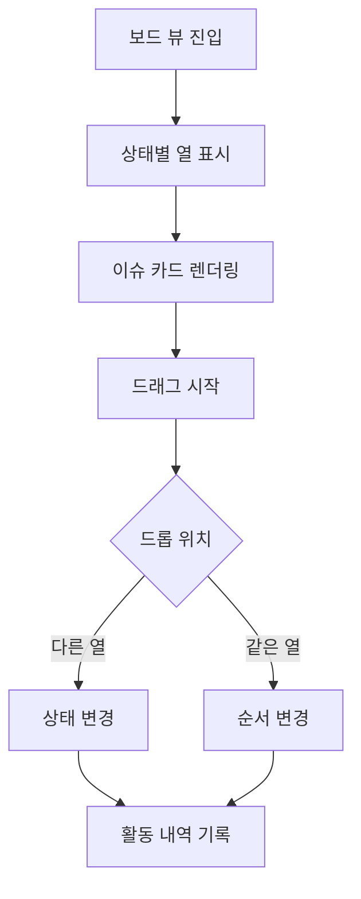
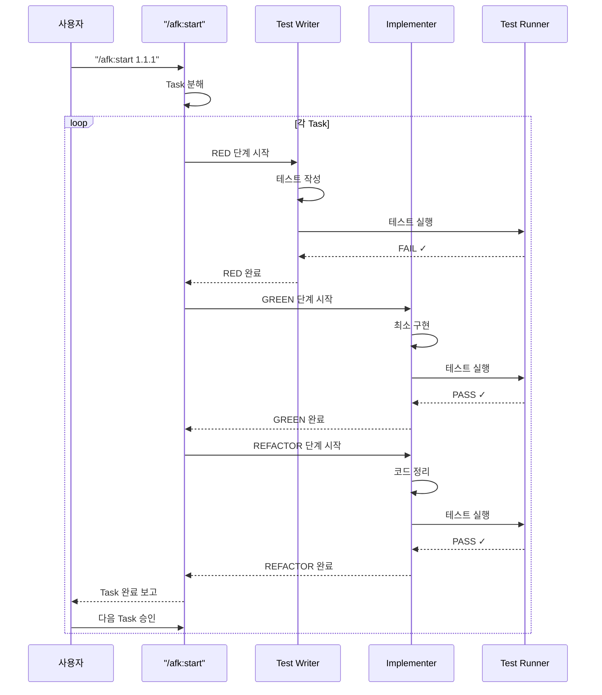

# /afk:start <feature-id>

Feature를 시작하고 **자동 TDD 사이클**을 실행합니다.

## 동작

### 0단계: 프로젝트 설계 확인

**가장 먼저 프로젝트 설계가 완료되었는지 확인합니다.**

```
클로드코드> Feature 1.1.1: 이슈 생성을 시작합니다.

프로젝트 설치 상태를 확인 중...

[project-design.json이 존재하지 않는 경우]

❌ 프로젝트 설계가 완료되지 않았습니다.

먼저 /afk:design으로 프로젝트를 설계해주세요.

(Hint: project-design.json이 존재하고, state.json.projectDesignStatus가 "completed"여야 합니다)

---

[project-design.json이 존재하고 설계가 완료된 경우]

✅ 프로젝트 설계 확인 완료.
- Architecture: 2-tier (Frontend + Backend + Database)
- Frontend: React + Vite + shadcn/ui
- Backend: FastAPI + PostgreSQL
```

### 0.5단계: Research 안내

**TDD 사이클 시작 전, Research를 권장합니다.**

```
클로드코드> Feature 1.1.1에 대한 TDD 사이클을 시작합니다.

💡 팁: 아직 Research를 수행하지 않았다면 먼저 실행해보세요.

/afk:research 1.1.1

Research를 통해 다음을 확인할 수 있습니다:
- 프로젝트 구조 분석
- 기존 코드 패턴 파악
- 의존성 확인
- 구현 난이도 평가
- 추천 접근 방식

Research를 건너뛰고 바로 시작하시겠습니까?
1. 예 (바로 시작)
2. 아니오 (/afk:research 실행)

사용자> 1

좋습니다. TDD 사이클을 시작합니다.
```

### 1단계: Feature 확인

1. `<feature-id>`로 Feature를 찾습니다
2. 현재 상태를 확인합니다
3. 이미 Task가 있으면 TDD 사이클 재개

### 1.5단계: 재진입 감지

**이미 진행 중인 Feature를 다시 시작할 경우, 재진입 안내를 제공합니다.**

```
사용자> /afk:start 1.1.1

클로드코드> Feature 1.1.1을 시작합니다.

⚠️ 이 Feature는 이미 진행 중입니다.

## 현재 상태

### Feature 1.1.1: 이슈 생성
- 진행률: 60% (1/5 Task 완료)
- 마지막 작업: 2025-02-02 10:35

### 진행 중인 Task
**Task 1**: 이슈 생성 기능 구현
TDD Phase: 🔄 REFACTOR 진행 중

### TDD 사이클 상태
\```
✅ RED    → 테스트 작성 완료
✅ GREEN  → 최소 구현 완료
🔄 REFACTOR → 코드 정리 진행 중
\```

### 마지막 작업
- 타입 정의 추가
- 검증 로직 분리

---

어디서부터 다시 시작할까요?
1. 중단된 지점부터 계속 (REFACTOR 완료)
2. 처음부터 다시 시작 (기존 작업 초기화)
3. 상태만 보기 (/afk:task)
4. 취소

사용자> 1

좋습니다. 중단된 지점부터 다시 시작합니다.

## REFACTOR 단계 재개

테스트 실행 결과:
\```
PASS src/services/__tests__/IssueService.test.ts
  ✓ should create an issue with valid input
  ✓ should throw error when title is empty
  ✓ should throw error when title contains only whitespace
  ✓ should throw error when description is empty
\```

✓ **REFACTOR 완료**: Task 1이 완료되었습니다.
```

### 1.5.1단계: 재진입 옵션별 동작

#### 옵션 1: 중단된 지점부터 계속

```
사용자> 1

클로드코드> 중단된 지점부터 다시 시작합니다.

[해당 TDD Phase 재개]
- RED 진행중 → 테스트 작성 재개
- GREEN 진행중 → 구현 재개
- REFACTOR 진행중 → 코드 정리 재개
```

#### 옵션 2: 처음부터 다시 시작

```
사용자> 2

클로드코드> 정말 처음부터 다시 시작하시겠습니까?

⚠️ 주의: 다음 작업이 초기화됩니다.
- 생성된 테스트 파일
- 구현된 코드
- Task 진행 상태

정말 다시 시작하시겠습니까?
1. 예 (모두 초기화)
2. 아니오 (취소)

사용자> 1

기존 작업을 초기화하고 다시 시작합니다.
[Task 상태 초기화 후 처음부터 시작]
```

#### 옵션 3: 상태만 보기

```
사용자> 3

클로드코드> /afk:task로 상태를 표시합니다.

[전체 Task 목록 표시]
```

#### 옵션 4: 취소

```
사용자> 4

클로드코드> 취소했습니다.

다음 명령어를 사용할 수 있습니다:
- /afk:checkin - 현재 상황 다시 확인
- /afk:task - 전체 Task 목록 보기
```

### 2단계: 복잡도 판단

Feature가 다음 조건 중 하나라도 만족하면 **복잡**으로 판단:
- 3개 이상의 하위 Feature 포함
- 새로운 기술/라이브러리 도입 필요
- UI/UX 설계 필요
- 아키텍처 변경 필요

### 3단계: 단순한 Feature (즉시 Task 분해)

```
사용자> /afk:start 1.1.1

클로드코드> Feature 1.1.1: 이슈 생성을 시작합니다.

해당 Feature는 단순한 구현으로 판단됩니다. 즉시 Task List를 작성합니다.

## 제안된 Task List

1. 이슈 데이터 모델 정의
2. UI 폼 컴포넌트 생성 (제목/설명/우선순위/담당자)
3. 저장 버튼 핸들러 구현
4. 유효성 검사 로직 추가
5. Backend API 연동

승인하시겠습니까?
1. Accept
2. Decline
3. (의견 입력)

사용자> 1

클로드코드> Task List를 승인했습니다.
.afk-mod/features/1.1.1/tasks/task-001.md ~ task-005.md로 저장했습니다.
이제 병렬 실행 가능한 Task 그룹을 실행할 준비가 되었습니다.
```

### 4단계: 복잡한 Feature (에이전트 호출)

```
사용자> /afk:start 3.1.1

클로드코드> Feature 3.1.1: 칸반 보드 렌더링을 시작합니다.

해당 Feature는 복잡한 구현으로 판단됩니다. 전문가 에이전트를 호출하여 분석을 시작합니다.

---

## UX Designer Agent 분석 결과

### 사용자 흐름



### UI 초안
- 열: 할 일 / 진행 중 / 검토 / 완료
- 카드: 제목, 담당자 아바타, 우선순위 색상
- 드래그: 시각적 피드백 (그림자 효과)

---

## CTO Agent 분석 결과

### 아키텍처

```mermaid
classDiagram
    class BoardController {
        +getBoard()
        +updateIssueStatus()
    }
    class BoardService {
        +getIssuesByStatus()
        +updateStatus()
        +logActivity()
    }
    class IssueAPI {
        +GET /issues?status=
        +PATCH /issues/{id}/status
    }
    class Database {
        +issues table
        +activity_log table
    }

    BoardController --> BoardService
    BoardService --> IssueAPI
    IssueAPI --> Database
```

### 기술 스택
- Frontend: React + @dnd-kit/core (드래그앤드롭)
- API: FastAPI REST API
- Database: PostgreSQL

---

## Researcher Agent 분석 결과

### @dnd-kit/core 드래그앤드롭

```typescript
import { DndContext, closestCenter } from '@dnd-kit/core';
import { SortableContext, verticalListSortingStrategy } from '@dnd-kit/sortable';

function KanbanBoard() {
  const handleDragEnd = (event) => {
    const { active, over } = event;
    if (active.id !== over.id) {
      // 상태 변경 API 호출
    }
  };

  return (
    <DndContext collisionDetection={closestCenter} onDragEnd={handleDragEnd}>
      {/* 열과 카드 렌더링 */}
    </DndContext>
  );
}
```

### 베스트 프랙티스
- 드래그 중 최적화: sensor 옵션으로 터치/마우스 지원
- 충돌 감지: closestCenter로 가장 가까운 드롭 타겟 찾기
- 접근성: 키보드 네비게이션 지원

---

## 종합 제안

위 분석을 바탕으로 다음 Task List를 제안합니다:

1. 보드 레이아웃 컴포넌트 구현 (UX 디자인 기반)
2. Backend API 엔드포인트 구현 (아키텍처 기반)
3. @dnd-kit/core 드래그앤드롭 연동 (리서치 기반)
4. 실시간 상태 동기화
5. 테스트 코드 작성 (TDD)

승인하시겠습니까?
1. Accept
2. Decline
3. (의견 입력)

사용자> 1

클로드코드> 좋습니다. 이 결정을 문서로 남기겠습니다.
.afk-mod/features/3.1.1/decision-2025-02-02T10:30:00Z.md로 저장했습니다.

Task List를 생성하고 있습니다...
.afk-mod/features/3.1.1/tasks/에 5개의 Task를 저장했습니다.
```

## 5단계: TDD 자동화 사이클 시작

Task List가 생성되면 **자동으로 TDD 사이클**이 시작됩니다.

```
클로드코드> Task List를 생성했습니다.

## Task 1: 이슈 생성 기능 구현

### TDD 사이클 시작...

---

### RED 단계: 테스트 작성

Test Writer Agent가 테스트를 작성합니다.

테스트 케이스 정의:
- 정상 입력으로 이슈 생성 성공
- 빈 제목으로 이슈 생성 시도 → ValidationError
- 빈 설명으로 이슈 생성 시도 → ValidationError
- 공백만 제목 → ValidationError
- 제목 중복 → 허용

`src/services/__tests__/IssueService.test.ts` 생성 완료

테스트 실행 결과:
\```
FAIL src/services/__tests__/IssueService.test.ts
  IssueService.createIssue
    ✗ should create an issue with valid input
      ReferenceError: IssueService is not defined
    ✗ should throw error when title is empty
      ReferenceError: IssueService is not defined
\```

✓ **RED 단계 완료**: 테스트가 예상대로 실패했습니다.

---

### GREEN 단계: 최소 구현

Implementer Agent가 최소 구현을 작성합니다.

테스트 실패 분석:
- `IssueService` 클래스가 정의되지 않음

`src/services/IssueService.ts` 생성 완료

테스트 실행 결과:
\```
PASS src/services/__tests__/IssueService.test.ts
  ✓ should create an issue with valid input
  ✓ should throw error when title is empty
  ✓ should throw error when title contains only whitespace
  ✓ should throw error when description is empty
  ✓ should allow duplicate titles
\```

✓ **GREEN 단계 완료**: 모든 테스트 통과

---

### REFACTOR 단계: 코드 정리

Implementer Agent가 코드를 정리합니다.

리팩토링 항목:
1. 타입 정의 추가 (`CreateIssueInput`, `Issue`)
2. 검증 로직을 별도 메서드로 분리
3. `ValidationError` 커스텀 에러 클래스 사용
4. ID 생성 로직 분리

테스트 실행 결과:
\```
PASS src/services/__tests__/IssueService.test.ts
  ✓ should create an issue with valid input
  ✓ should throw error when title is empty
  ✓ should throw error when title contains only whitespace
  ✓ should throw error when description is empty
  ✓ should allow duplicate titles
\```

✓ **REFACTOR 단계 완료**: 테스트 통과 유지

---

## Task 1 완료

TDD 사이클이 완료되었습니다.

### 생성된 파일
- `src/services/__tests__/IssueService.test.ts` (테스트)
- `src/services/IssueService.ts` (구현)
- `src/types/Issue.ts` (타입 정의)

### 다음 Task로 넘어갈까요?
1. 예 (다음 Task 시작)
2. 아니오 (코드 검토 후 진행)
3. 멈춤 (수동으로 계속)
```

## TDD 사이클 상태 저장

각 단계가 완료될 때마다 `state.json`에 상태가 저장됩니다:

```json
{
  "currentFeature": "1.1.1",
  "currentTask": "task-001",
  "tddPhase": "REFACTOR",
  "tasks": {
    "task-001": {
      "status": "in_progress",
      "tdd": {
        "red": {
          "status": "completed",
          "testFile": "src/services/__tests__/IssueService.test.ts",
          "completedAt": "2025-02-02T10:30:00Z"
        },
        "green": {
          "status": "completed",
          "implFile": "src/services/IssueService.ts",
          "completedAt": "2025-02-02T10:32:00Z"
        },
        "refactor": {
          "status": "in_progress",
          "startedAt": "2025-02-02T10:32:00Z"
        }
      }
    },
    "task-002": {
      "status": "pending"
    }
  }
}
```

## Agent 호출 시퀀스



## Human-in-the-Loop 간격

TDD 사이클은 **Task 단위로** 사용자 승인을 요청합니다:

- **RED → GREEN → REFACTOR**: 자동 진행 (사용자 개입 없음)
- **Task 완료 후**: 다음 Task 진행 여부 확인

```
## Task 1 완료

다음 Task로 넘어갈까요?
1. 예 (계속)
2. 아니오 (검토)
3. 멈춤 (/afk:task로 수동 재개)
```

## 의존성 처리

- Task 분해 전 Dependencies 필드 확인
- 선행 Feature가 완료되지 않았으면 경고

## Human-in-the-Loop 옵션

모든 승인 단계에서 사용자 선택지 제공:
1. **예 (계속)**: 다음 Task로 자동 진행
2. **아니오 (검토)**: 코드 검토 후 `/afk:task`로 수동 재개
3. **멈춤**: TDD 사이클 중단, `/afk:task`로 수동 재개
