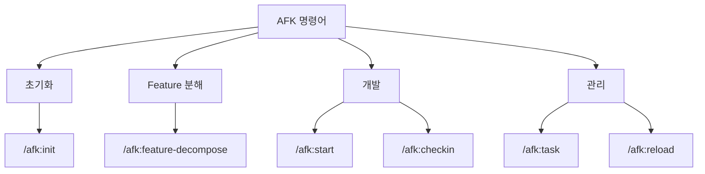
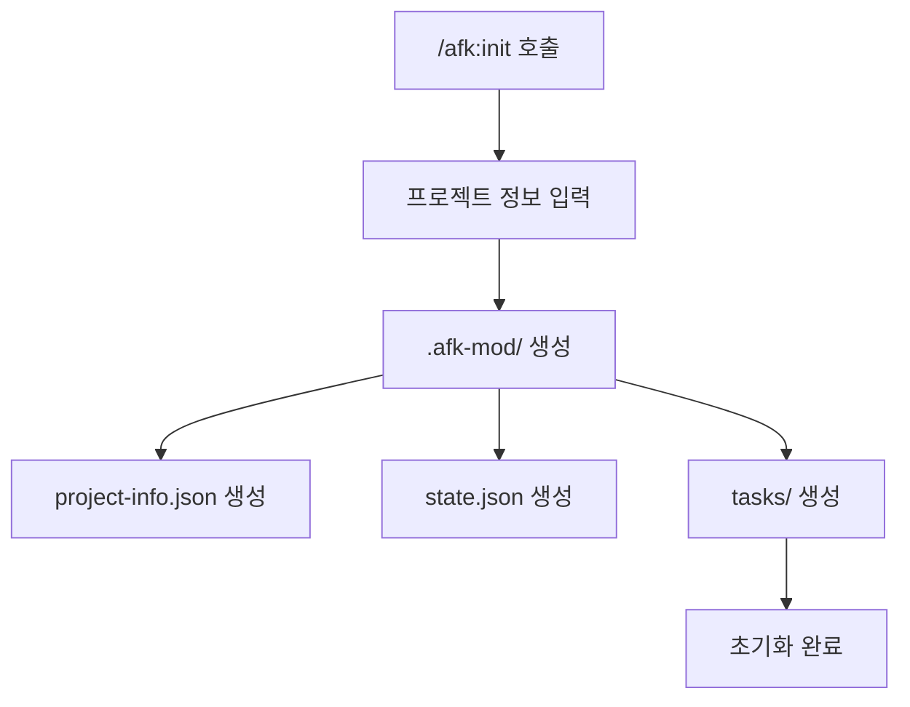
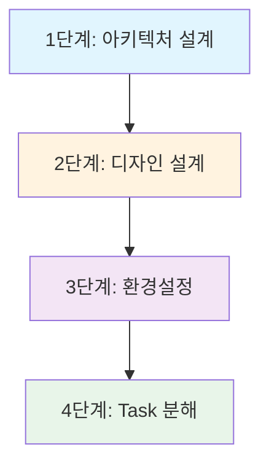
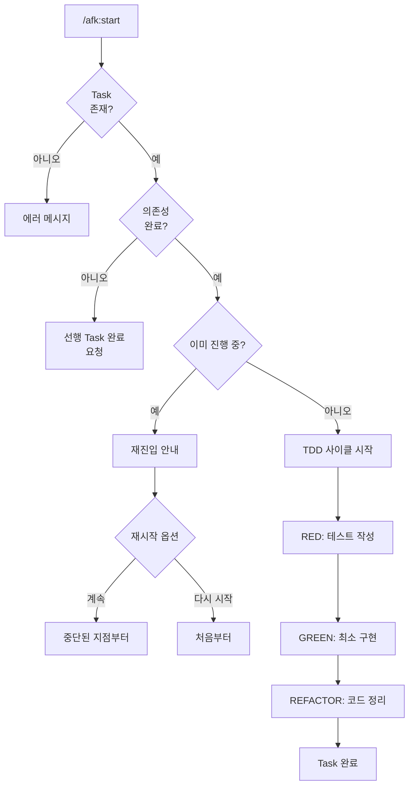
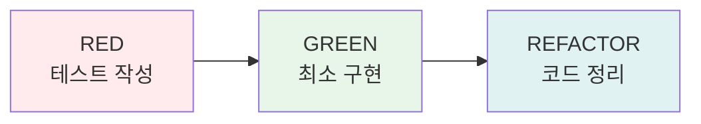
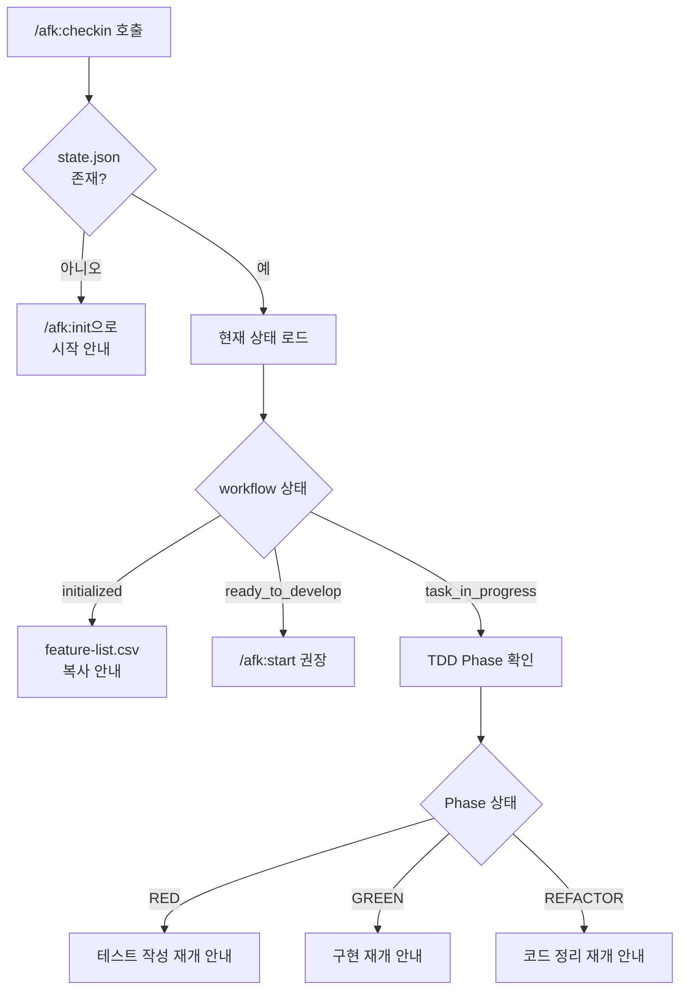
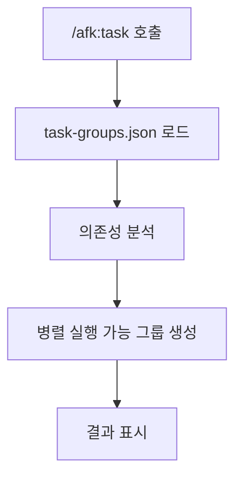
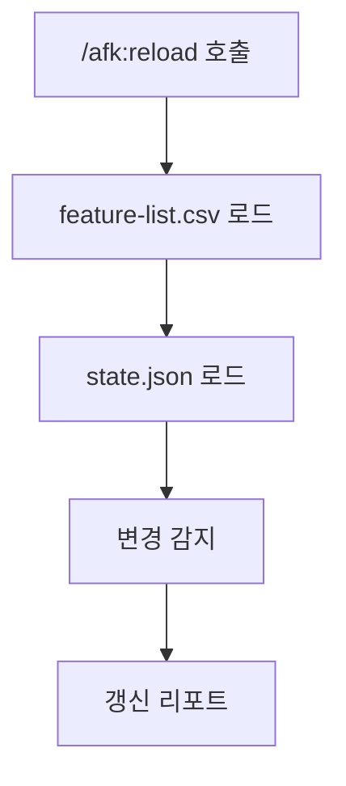

# 명령어 상세 가이드

AFK의 모든 명령어와 사용 방법을 상세히 설명합니다.

## 명령어 개요



## /afk:init

프로젝트를 초기화하고 `.afk-mod/` 디렉토리를 생성합니다.

### 동작 흐름



### 사용 예시

```
/afk:init
```

### 생성되는 파일

```
.afk-mod/
├── project-info.json    # 프로젝트 기본 정보
├── state.json           # 워크플로우 상태
└── tasks/               # Task 저장소
```

---

## /afk:feature-decompose

Feature를 4단계 프로세스로 분해하여 Task로 변환합니다.

### 4단계 프로세스



### 사용 예시

```
/afk:feature-decompose
```

### 각 단계 상세

#### 1단계: 아키텍처 설계

**질문 항목:**
- 데이터베이스 선택
- 실시간 기능 여부
- 인증/인가 방식
- API 스타일
- 배포 환경
- 아키텍처 패턴

**결과물:** `.afk-mod/architecture-design.md`

#### 2단계: 디자인 설계

**질문 항목:**
- 디자인 시스템
- 다크 모드
- 모바일 지원
- 색상 테마
- 레이아웃 스타일

**결과물:** `.afk-mod/design-design.md`

#### 3단계: 환경설정

**질문 항목:**
- 언어
- 프레임워크
- 패키지 매니저
- 테스트 도구
- 코드 품질 도구
- CI/CD

**결과물:** `.afk-mod/environment-setup.md`

#### 4단계: Task 분해

- Feature를 fine-grained Task로 분해
- Task 그룹화 (최대 5-7개)
- 의존성 명시 (blockedBy)

**결과물:**
- `.afk-mod/tasks/task-groups.json`
- `.afk-mod/tasks/tg-*.json`

---

## /afk:start

Task를 시작하고 TDD 사이클을 실행합니다.

### 동작 흐름



### 사용 예시

```
/afk:start 1.1.1
```

### TDD 사이클



---

## /afk:checkin

중단된 작업을 다시 시작할 때 현재 상황을 파악합니다.

### 동작 흐름



### 사용 예시

```
/afk:checkin
```

### 출력 형식

````
## 📊 현재 작업 중
### Task 1.1.1: 로그인 폼 UI 구현
**TDD Phase**: 🔄 REFACTOR 진행 중

## 🚀 다음 단계
1. 계속하기 - REFACTOR 완료
2. 검토하기 - 현재 코드 확인
````

---

## /afk:task

전체 Task 목록을 표시하고 관리합니다.

### 동작 흐름



### 사용 예시

```
/afk:task
```

### 출력 형식

```
# Task List

## 그룹: tg-1.1-auth (인증 시스템)
- [1.1.1] ✅ 완료: 로그인 폼 UI 구현
- [1.1.2] 🔵 진행중: 로그인 API 엔드포인트 구현
- [1.1.3] ⚪ 대기: 로그인 폼과 API 연결 (blockedBy: 1.1.1, 1.1.2)
- [1.1.4] ⚪ 대기: JWT 검증 미들웨어 (blockedBy: 1.1.2)
- [1.1.5] ⚪ 대기: 로그아웃 기능 (blockedBy: 1.1.3)

## 그룹: tg-1.2-user-profile (사용자 프로필)
- [1.2.1] ⚪ 대기: 프로필 폼 UI
...
```

---

## /afk:reload

Task List를 다시 읽어 상태를 갱신합니다.

### 동작 흐름



### 사용 예시

```
/afk:reload
```

---

## 명령어 비교

| 명령어 | 목적 | 입력 | 출력 |
|--------|------|------|------|
| `/afk:init` | 프로젝트 초기화 | 프로젝트 정보 | `.afk-mod/` 구조 |
| `/afk:feature-decompose` | Feature 분해 | feature-list.csv | 4단계 설계 + Task |
| `/afk:start` | TDD 사이클 시작 | task-id | RED → GREEN → REFACTOR |
| `/afk:checkin` | 세션 재개 | - | 현재 상태 + 다음 단계 |
| `/afk:task` | Task 관리 | - | 전체 Task 목록 |
| `/afk:reload` | 상태 갱신 | - | 갱신 리포트 |

## 사용 시나리오

````
# 새 프로젝트 시작
/afk:init
cp feature-list.csv .afk-mod/
/afk:feature-decompose
/afk:start 1.1.1

# 작업 중단 후 재개
/afk:checkin

# Task 상태 확인
/afk:task

# Feature List 변경 후 갱신
/afk:reload
````
