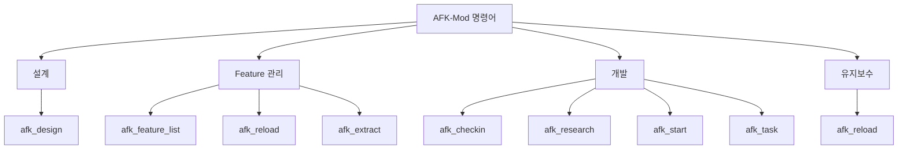
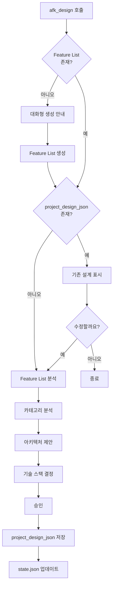
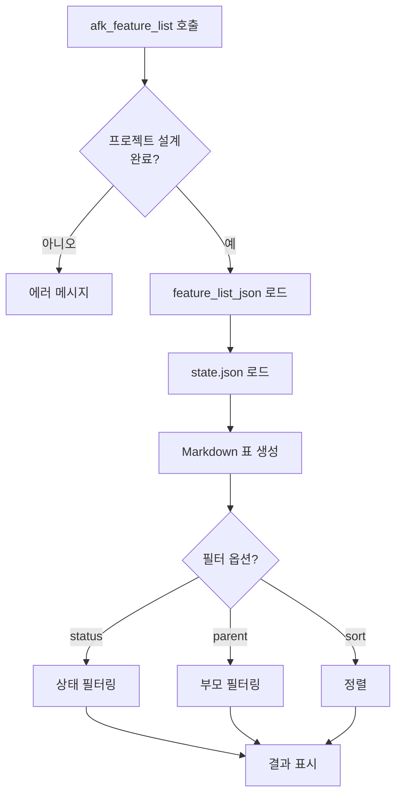
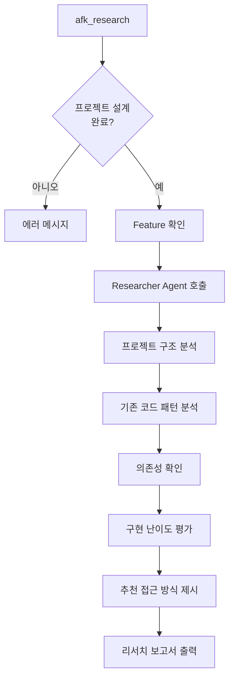
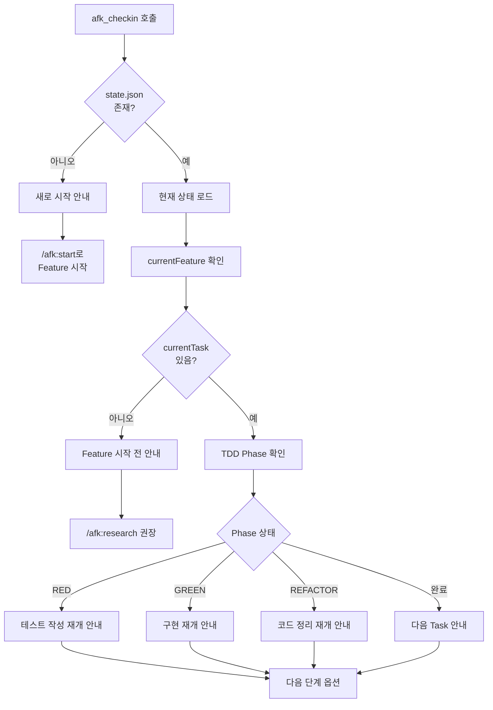
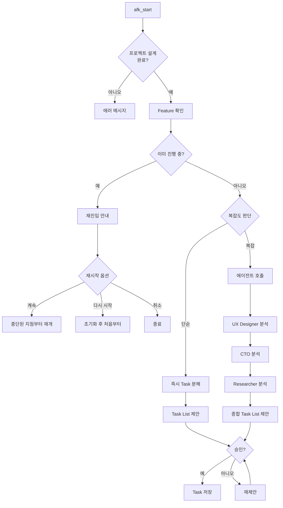
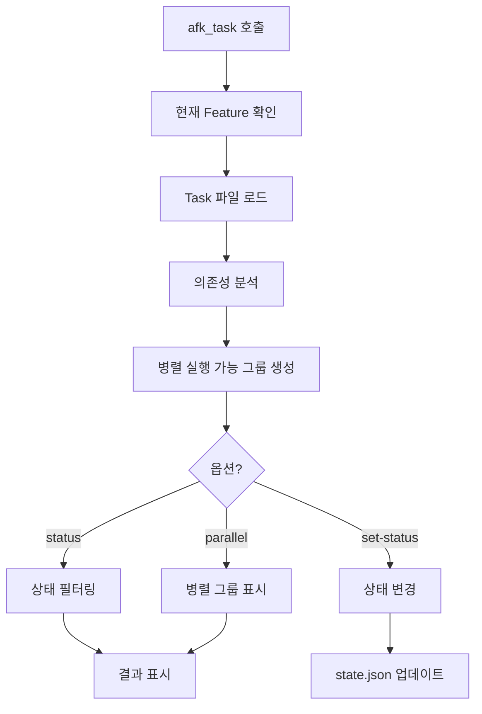
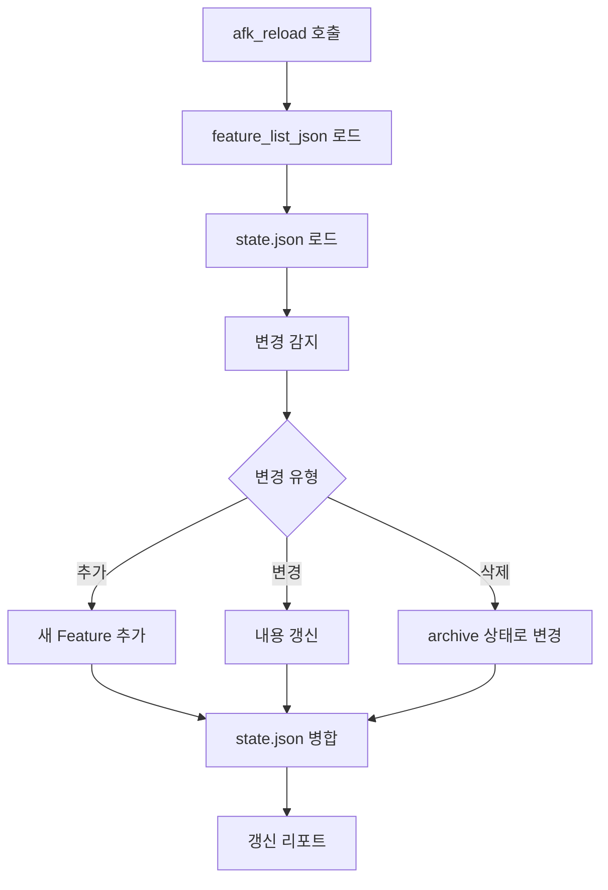
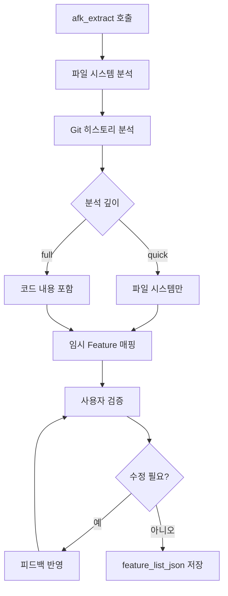
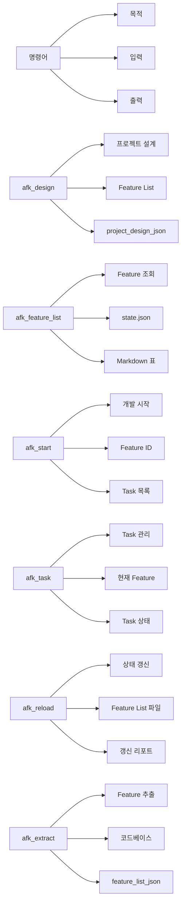

# 명령어 상세 가이드

AFK-Mod의 모든 명령어와 사용 방법을 상세히 설명합니다.

## 명령어 개요



## afk_design

프로젝트 설계를 수행하는 첫 번째 명령어입니다.

### 동작 흐름



### 사용 예시

```
afk_design
```

### 옵션

| 옵션 | 설명 |
|------|------|
| `--file=<path>` | 특정 Feature List 파일 지정 |

---

## afk_feature_list

Feature 목록과 진척도를 표시합니다.

### 동작 흐름



### 출력 형식

```
# Feature List

| ID | Title | Parent | Status | Progress |
|----|-------|--------|--------|----------|
| 1 | 이슈 관리 | - | PENDING | 0% |
| 1.1 | 이슈 CRUD | 1 | IN_PROGRESS | 80% |
| 1.1.1 | 이슈 생성 | 1.1 | DONE | 100% |
```

### 옵션

| 옵션 | 설명 | 예시 |
|------|------|------|
| `--status` | 특정 상태만 표시 | `--status=IN_PROGRESS` |
| `--parent` | 특정 부모 하위만 표시 | `--parent=1` |
| `--sort` | 정렬 기준 | `--sort=progress` |

---

## afk_research

**STAGE 2: RESEARCH** - Feature 구현을 위한 프로젝트 구조와 기존 코드 패턴을 분석합니다.

### 동작 흐름



### 사용 예시

```
afk_research 1.1.1
```

### 출력 형식

```
## STAGE 2: RESEARCH

### 프로젝트 구조 분석
#### 현재 파일 구조
web/
├── src/
│   ├── components/
│   │   ├── IssueForm.tsx
│   │   └── IssueList.tsx
│   ├── services/
│   │   └── IssueService.ts
│   └── types/
│       └── Issue.ts

### 기존 코드 패턴 분석
#### Service Layer 패턴
- API 호출은 Service 클래스에서 담당
- 에러 처리: ValidationError 커스텀 클래스

### 의존성 확인
- Frontend: React, Vite, shadcn/ui, React Query
- Backend: FastAPI, SQLAlchemy, PostgreSQL

### 구현 난이도 평가
- 복잡도: 중간
- 예상 소요 시간: 2시간

### 추천 접근 방식
1. 기존 IssueService 확장
2. 테스트는 __tests__/에 작성
3. API 엔드포인트는 api/app/api/issues/에 추가

✅ Research 완료. 이제 /afk:start 1.1.1로 TDD를 시작하세요.
```

### 옵션

| 옵션 | 설명 |
|------|------|
| `--depth=quick` | 빠른 분석 (파일 구조만) |
| `--depth=full` | 상세 분석 (코드 패턴 포함) |

---

## afk_checkin

**중단된 작업을 다시 시작할 때 현재 상황을 파악하고 다음 단계를 안내합니다.**

### 동작 흐름



### 사용 예시

```
afk_checkin
```

### 출력 형식

```
## 📊 현재 작업 중

### Feature 1.1.1: 이슈 생성

#### 진행 중인 Task
**Task 1**: 이슈 생성 기능 구현
상태: 🔄 REFACTOR 진행 중

#### TDD 사이클 상태
\```
✅ RED    → 테스트 작성 완료 (10:30)
✅ GREEN  → 최소 구현 완료 (10:32)
🔄 REFACTOR → 코드 정리 진행 중
\```
````

#### 마지막 작업 내역
- 타입 정의 추가
- 검증 로직 분리

---

## 🚀 다음 단계

REFACTOR 단계를 완료하고 다음 Task로 넘어갈까요?

1. **계속하기** - REFACTOR 완료 후 Task 2로 진행
2. **검토하기** - 현재 코드 먼저 검토
3. **상태보기** - 전체 Task 목록 보기 (/afk:task)
```

### TDD Phase별 체크인 메시지

| Phase | 메시지 |
|-------|--------|
| RED 진행 중 | 테스트 케이스 작성 중, 완료되지 않은 테스트 N개 |
| GREEN 진행 중 | 최소 구현 작성 중, 실패한 테스트 N개 |
| REFACTOR 진행 중 | 코드 정리 중, 완료된 리팩토링 N/M |
| Task 완료 | Task 완료! 다음 Task로 넘어갈 준비 |
| Feature 시작 전 | Research 권장, /afk:start로 시작 가능 |

### /afk:task와의 차이점

| 특징 | /afk:checkin | /afk:task |
|------|--------------|-----------|
| 목적 | 중단 후 재개 시 상태 파악 | 전체 Task 목록 및 상태 관리 |
| 출력 | 사용자 친화적 요약 | 기술적 상세 정보 |
| 다음 단계 | 명확한 안내 및 옵션 | 상태 확인 후 수동 재개 |
| 사용 시점 | 세션 재시작 시 | 언제든지 |

---

## afk_start

Feature 개발을 시작하고 Task 분해를 수행합니다.

### 동작 흐름



### 사용 예시

```
afk_start 1.1.1
```

### 복잡도 판단 기준

| 조건 | 복잡도 |
|------|--------|
| 3개 이상 하위 Feature | 복잡 |
| 새로운 기술 도입 필요 | 복잡 |
| UI/UX 설계 필요 | 복잡 |
| 아키텍처 변경 필요 | 복잡 |
| 그 외 | 단순 |

---

## afk_task

현재 Feature의 Task 목록을 표시하고 관리합니다.

### 동작 흐름



### 출력 형식

```
# Feature 1.1.2: 이슈 목록 조회 - Task List

## 병렬 실행 가능한 Task 그룹 1
- [task-1] 🔵 pending: CSV 파싱 모듈 구현
- [task-2] 🔵 pending: UI 컴포넌트 기본 구조 생성

## 병렬 실행 가능한 Task 그룹 2 (task-1, task-2 완료 후)
- [task-3] ⚪ blocked: 필터/정렬 로직 구현 (blockedBy: task-1)

## 진척도: 20% (1/5 완료)
```

### 옵션

| 옵션 | 설명 | 예시 |
|------|------|------|
| `--status` | 특정 상태의 Task만 표시 | `--status=pending` |
| `--parallel` | 병렬 실행 가능한 그룹 표시 | `--parallel` |
| `--set-status` | Task 상태 변경 | `--set-status=task-1:completed` |

---

## afk_reload

Feature List 파일을 다시 읽어 상태를 갱신합니다.

### 동작 흐름



### 사용 예시

```
afk_reload
```

### 옵션

| 옵션 | 설명 |
|------|------|
| `--path` | 다른 경로의 파일 지정 |

---

## afk_extract

기존 코드베이스를 분석하여 Feature List를 추출합니다.

### 동작 흐름



### 사용 예시

```
afk_extract
```

### 옵션

| 옵션 | 설명 |
|------|------|
| `--depth=quick` | 빠른 분석 (파일 시스템만) |
| `--depth=full` | 상세 분석 (코드 내용 포함) |
| `--commits` | 분석할 커밋 수 지정 |

---

## 명령어 비교


