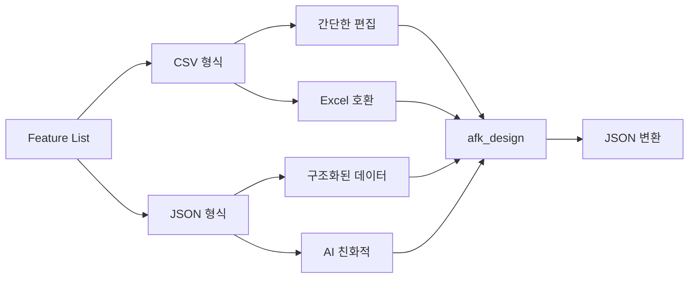
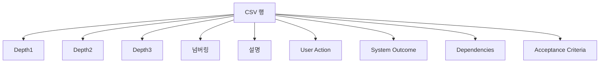
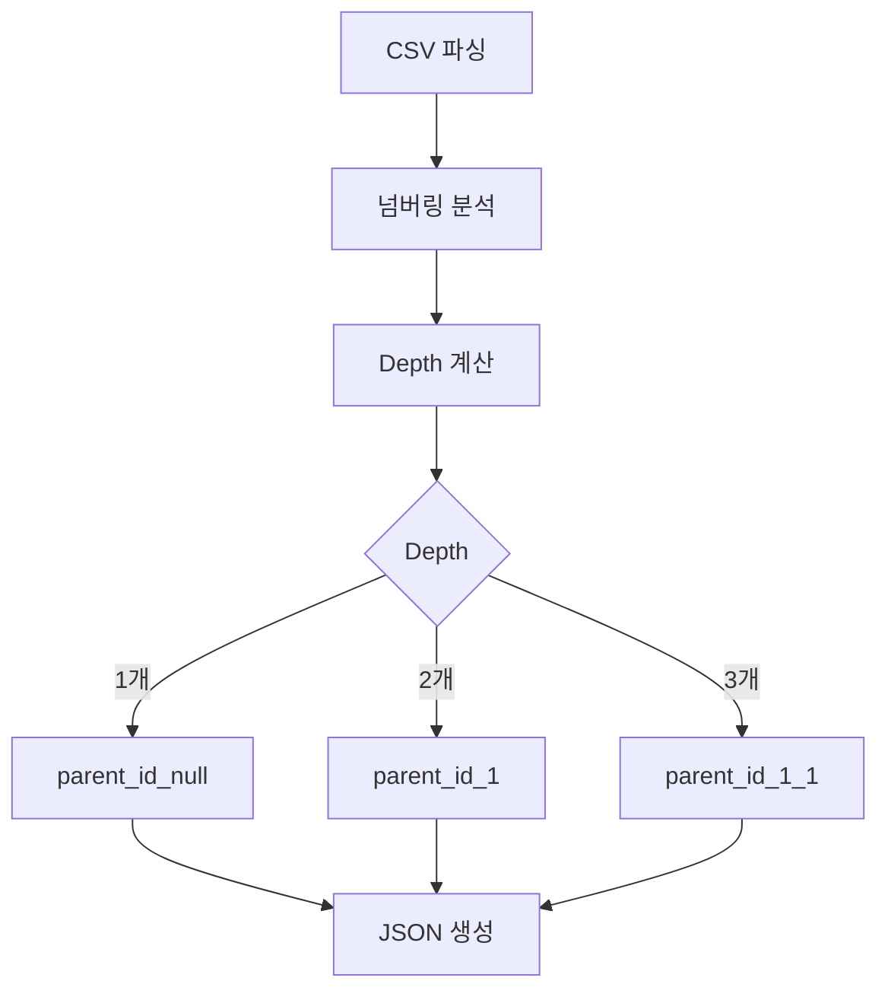
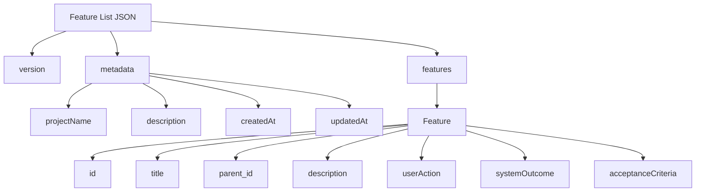
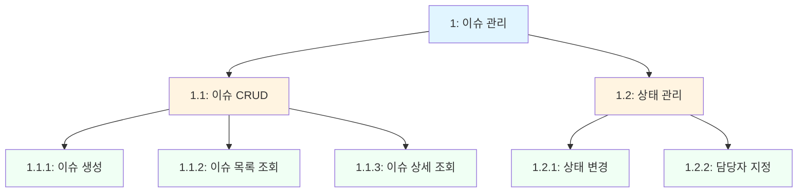
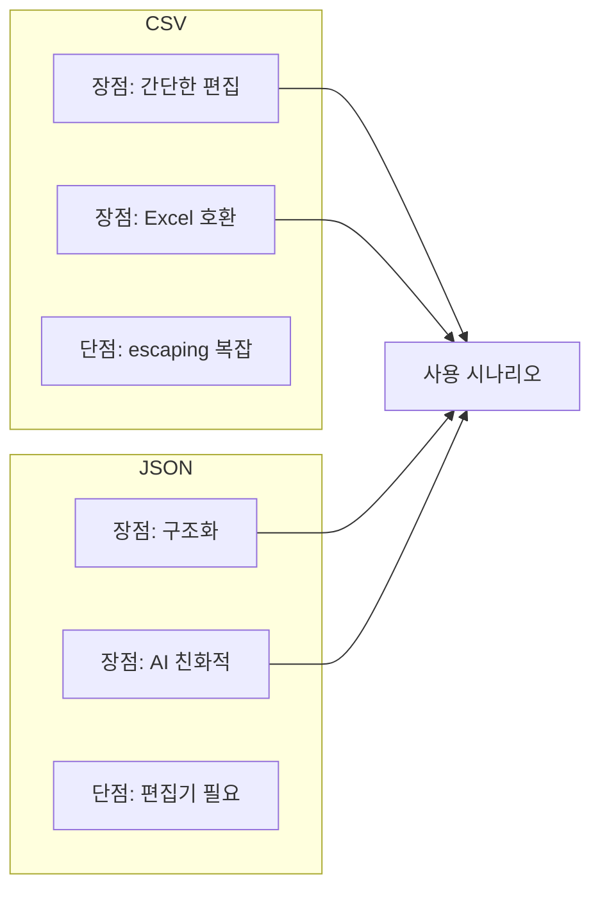
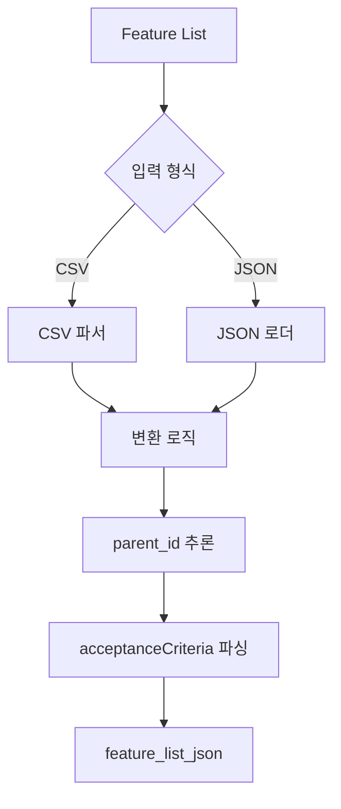

# Feature List 형식

> **NOTE**: 이 문서의 모든 예시는 **Issue Tracker 프로젝트**를 기반으로 한 예시입니다.
> 실제 사용 시, 프로젝트의 도메인과 요구사항에 맞게 용어와 구조를 수정하여 적용하세요.

AFK-Mod에서 사용하는 Feature List의 CSV와 JSON 형식을 설명합니다.

## 형식 개요



## CSV 형식

### 파일 위치

```
.afk-mod/feature-list.csv
```

### 스키마



### 예제

```csv
Depth1,Depth2,Depth3,넘버링,설명,User Action,System Outcome,Dependencies,Acceptance Criteria
이슈 관리,,,1,이슈 생성, 조회, 수정, 삭제 기능,,,
이슈 관리,CRUD,,1.1,이슈 기본 CRUD 기능,,,,
이슈 관리,CRUD,생성,1.1.1,이슈 생성,사용자가 "새 이슈"에서 제목/설명/우선순위/담당자를 입력 후 저장한다,새 이슈가 생성되고 목록에 추가된다,-,제목 중복 허용; 필수 항목(제목, 설명) 검증; 저장 성공 시 목록/상세로 이동; 실패 시 원인 메시지 표시
```

### 필드 설명

| 필드 | 필수 | 설명 | 예시 |
|------|------|------|------|
| Depth1 | 아니오 | 최상위 카테고리 | 이슈 관리 |
| Depth2 | 아니오 | 2단계 카테고리 | CRUD |
| Depth3 | 아니오 | 3단계 카테고리 | 생성 |
| 넘버링 | 예 | Feature ID | 1.1.1 |
| 설명 | 예 | Feature 제목 | 이슈 생성 |
| User Action | 아니오 | 사용자 액션 | 사용자가 저장 버튼을 누른다 |
| System Outcome | 아니오 | 시스템 결과 | 이슈가 생성된다 |
| Dependencies | 아니오 | 의존 Feature ID | 1.1 |
| Acceptance Criteria | 아니오 | 인수 기준 (; 구분) | 필수 항목 검증; 저장 성공 시 이동 |

### CSV → JSON 변환 규칙



| 넘버링 | parent_id | 설명 |
|--------|-----------|------|
| 1 | null | 최상위 카테고리 |
| 1.1 | 1 | 2단계 카테고리 |
| 1.1.1 | 1.1 | 3단계 카테고리 (Leaf Feature) |

## JSON 형식

### 파일 위치

```
.afk-mod/feature-list.json
```

### 스키마



### 예제

```json
{
  "version": "1.0",
  "metadata": {
    "projectName": "Issue Tracker",
    "description": "팀 내 이슈 트래커 애플리케이션",
    "createdAt": "2025-02-02T00:00:00Z",
    "updatedAt": "2025-02-02T00:00:00Z"
  },
  "features": [
    {
      "id": "1",
      "title": "이슈 관리",
      "parent_id": null,
      "description": "이슈 생성, 조회, 수정, 삭제 기능"
    },
    {
      "id": "1.1",
      "title": "이슈 CRUD",
      "parent_id": "1",
      "description": "이슈 기본 CRUD 기능"
    },
    {
      "id": "1.1.1",
      "title": "이슈 생성",
      "parent_id": "1.1",
      "userAction": "사용자가 \"새 이슈\"에서 제목/설명/우선순위/담당자를 입력 후 저장한다",
      "systemOutcome": "새 이슈가 생성되고 목록에 추가된다",
      "acceptanceCriteria": [
        "제목 중복 허용",
        "필수 항목(제목, 설명) 검증",
        "저장 성공 시 목록/상세로 이동",
        "실패 시 원인 메시지 표시"
      ]
    }
  ]
}
```

### 필드 설명

| 필드 | 타입 | 필수 | 설명 |
|------|------|------|------|
| version | string | 예 | 포맷 버전 (예: "1.0") |
| metadata | object | 아니오 | 프로젝트 메타데이터 |
| metadata.projectName | string | 아니오 | 프로젝트 이름 |
| metadata.description | string | 아니오 | 프로젝트 설명 |
| metadata.createdAt | string | 아니오 | 생성일시 (ISO 8601) |
| metadata.updatedAt | string | 아니오 | 수정일시 (ISO 8601) |
| features | array | 예 | Feature 배열 |
| features[].id | string | 예 | Feature ID |
| features[].title | string | 예 | Feature 제목 |
| features[].parent_id | string/null | 예 | 부모 Feature ID (최상위는 null) |
| features[].description | string | 아니오 | 설명 |
| features[].userAction | string | 아니오 | 사용자 액션 (Given) |
| features[].systemOutcome | string | 아니오 | 시스템 결과 (Then) |
| features[].acceptanceCriteria | array | 아니오 | 인수 기준 배열 |

## 계층 구조



### 계층별 특징

| Depth | parent_id | 특징 | 예시 |
|-------|-----------|------|------|
| 1 (최상위) | null | 카테고리, 설명만 있음 | 1: 이슈 관리 |
| 2 | "1" | 하위 카테고리, 설명만 있음 | 1.1: 이슈 CRUD |
| 3 (Leaf) | "1.1" | 상세 Feature, 모든 필드 | 1.1.1: 이슈 생성 |

## CSV vs JSON 비교



| 비교 항목 | CSV | JSON |
|----------|-----|------|
| 편집 용이성 | ⭐⭐⭐ Excel로 편집 가능 | ⭐⭐ 텍스트 편집기 필요 |
| 가독성 | ⭐⭐ 열이 많으면 복잡 | ⭐⭐⭐ 구조화되어 읽기 쉬움 |
| AI 친화성 | ⭐⭐ escaping 필요 | ⭐⭐⭐ 구조화된 데이터 |
| 형상 관리 | ⭐⭐⭐ 변경 추적 용이 | ⭐⭐⭐ 변경 추적 용이 |
| 확장성 | ⭐⭐ 열 추가 제한 | ⭐⭐⭐ 필드 추가 자유로움 |

## 포맷 변환



### CSV → JSON 변환 예시

**입력 (CSV):**
```csv
이슈 관리,CRUD,생성,1.1.1,이슈 생성,사용자가 저장한다,이슈가 생성된다,-,필수 항목 검증; 저장 성공 시 이동
```

**출력 (JSON):**
```json
{
  "id": "1.1.1",
  "title": "이슈 생성",
  "parent_id": "1.1",
  "userAction": "사용자가 저장한다",
  "systemOutcome": "이슈가 생성된다",
  "acceptanceCriteria": [
    "필수 항목 검증",
    "저장 성공 시 이동"
  ]
}
```

## 샘플 파일

프로젝트 루트에 샘플 파일이 제공됩니다:

- `sample-feature-list.csv` - CSV 형식 샘플
- `sample-feature-list.json` - JSON 형식 샘플
