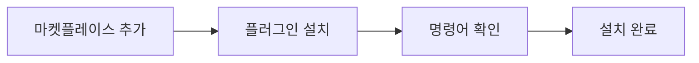
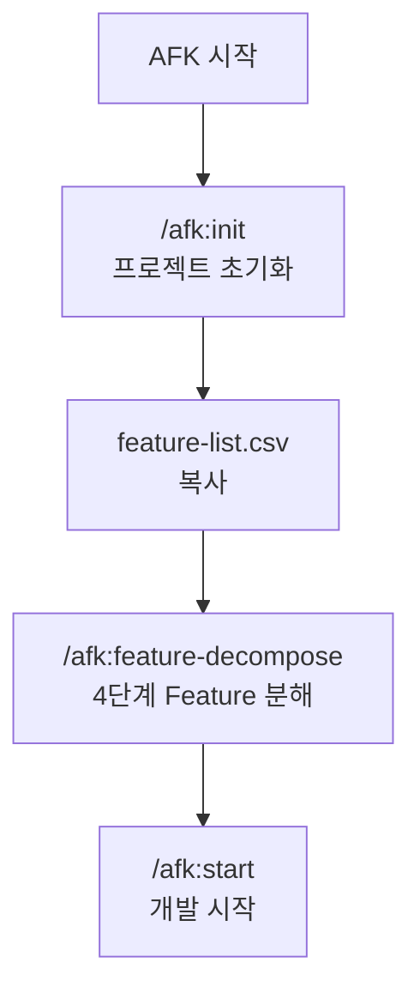
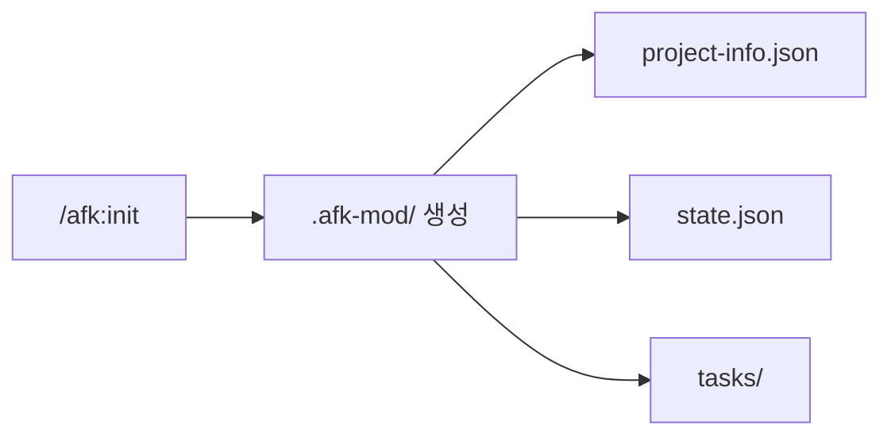
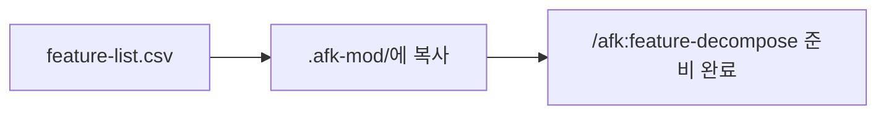
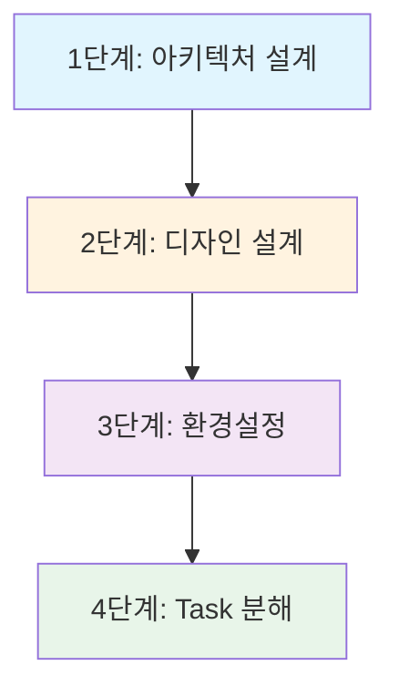
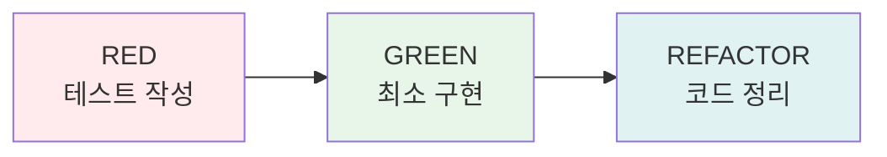

# 설치 및 시작하기

AFK 플러그인을 설치하고 첫 프로젝트를 시작하는 방법을 안내합니다.

## 설치



### 1. 마켓플레이스 추가

AFK가 포함된 마켓플레이스를 추가합니다:

```bash
/plugin marketplace add https://github.com/robinseo/afk-mod
```

### 2. 플러그인 설치

```bash
/plugin install afk
```

### 3. 설치 확인

```bash
/help
```

`/afk:init`, `/afk:feature-decompose`, `/afk:start` 등의 명령어가 표시되면 설치 완료입니다.

## 팀 프로젝트에서 자동 설치

저장소 수준에서 구성하면 팀 멤버가 자동으로 플러그인을 설치받습니다.

### `.claude/settings.json` 설정

```json
{
  "plugins": [
    {
      "name": "afk"
    }
  ]
}
```

팀 멤버가 저장소를 열면 플러그인이 자동으로 설치됩니다.

## 첫 프로젝트 시작



## 1단계: 프로젝트 초기화



**명령어:**

```
/afk:init
```

**프로젝트 정보 입력:**

```
클로드코드> AFK 프로젝트를 초기화합니다.

프로젝트 정보를 입력해주세요:

1. **프로젝트 이름**: my-awesome-app
2. **프로젝트 목적**: 사용자가 이슈를 추적할 수 있는 웹 애플리케이션

✅ 초기화 완료!

## 생성된 파일
- .afk-mod/project-info.json
- .afk-mod/state.json
- .afk-mod/tasks/
```

## 2단계: Feature List 준비

feature-list.csv를 `.afk-mod/` 디렉토리에 복사합니다.



**CSV 형식:**

```csv
id,parent,title,description,acceptance_criteria
1,,이슈 관리,이슈를 생성하고 관리할 수 있다,"AC1: 이슈 생성 가능|AC2: 이슈 수정 가능|AC3: 이슈 삭제 가능"
1.1,1,이슈 CRUD,이슈의 기본 CRUD 기능,"AC1: 이슈 생성|AC2: 이슈 조회|AC3: 이슈 수정|AC4: 이슈 삭제"
1.1.1,1.1,이슈 생성,제목과 설명으로 이슈를 생성할 수 있다,"AC1: 제목 필수|AC2: 설명 필수|AC3: 우선순위 선택"
1.1.2,1.1,이슈 조회,이슈 목록을 조회할 수 있다,"AC1: 전체 목록|AC2: 필터링|AC3: 정렬"
```

**복사 명령어:**

```bash
cp your-feature-list.csv .afk-mod/feature-list.csv
```

## 3단계: Feature 분해

```
/afk:feature-decompose
```

4단계 프로세스가 진행됩니다:



### 1단계: 아키텍처 설계

```
클로드코드> ## 1단계: 아키텍처 설계

다음 질문에 답변해주세요:

1. **데이터베이스**: PostgreSQL, MySQL, MongoDB, SQLite?
2. **실시간 기능**: WebSocket/SSE 필요 여부
3. **인증/인가**: JWT, OAuth, Session?
4. **API 스타일**: REST, GraphQL, tRPC?
5. **배포 환경**: Vercel, AWS, Docker?
...
```

### 2단계: 디자인 설계

```
클로드코드> ## 2단계: 디자인 설계

1. **디자인 시스템**: shadcn/ui, Chakra UI, Material UI, Tailwind CSS?
2. **다크 모드**: 지원 여부
3. **모바일 지원**: 반응형, PWA?
...
```

### 3단계: 환경설정

```
클로드코드> ## 3단계: 환경설정

1. **언어**: TypeScript, JavaScript, Python?
2. **프레임워크**: React, Next.js, Vue, Express, FastAPI?
3. **패키지 매니저**: npm, yarn, pnpm, bun?
...
```

### 4단계: Task 분해

```
클로드코드> ## 4단계: Task 분해

Feature를 Task로 분해하고 있습니다...

## 생성된 Task 그룹
- tg-1.1.1-auth: 인증 시스템 (5개 Task)
- tg-1.1.2-api: API 엔드포인트 (3개 Task)
- tg-1.1.3-ui: UI 컴포넌트 (4개 Task)

✅ Feature 분해 완료!
```

## 4단계: 개발 시작

```
/afk:start <task-id>
```

TDD 사이클이 자동으로 실행됩니다:



## 세션 재개

중간에 작업을 중단했다가 다시 돌아올 때:

```
/afk:checkin
```

```
클로드코드> 👋 다시 오셨군요!

## 📊 현재 작업 중
### Task 1.1.1: 로그인 폼 UI 구현
**TDD Phase**: 🔄 REFACTOR 진행 중

## 🚀 다음 단계
1. 계속하기 - REFACTOR 완료
2. 검토하기 - 현재 코드 확인
```

## 다음 단계

- [명령어 상세 가이드](commands.md)
- [워크플로우 상세](workflow.md)
- [Feature List 형식](feature-list-format.md)
