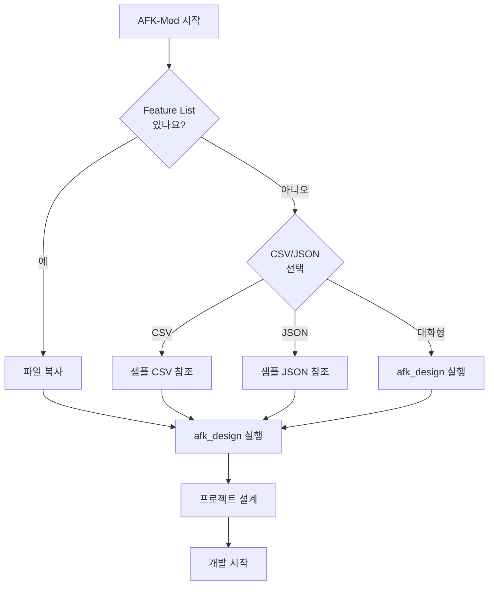
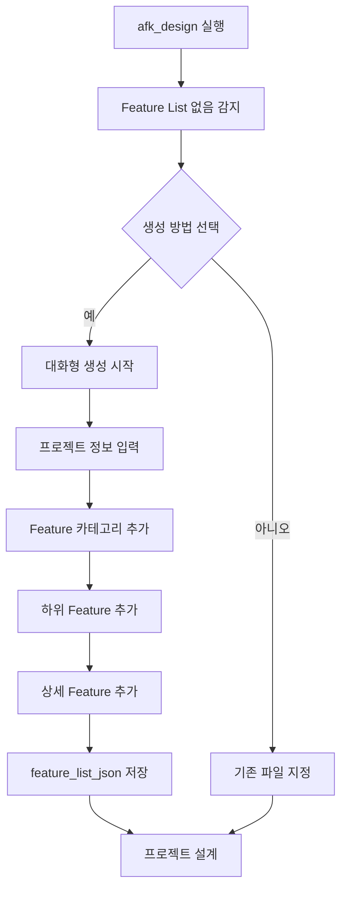
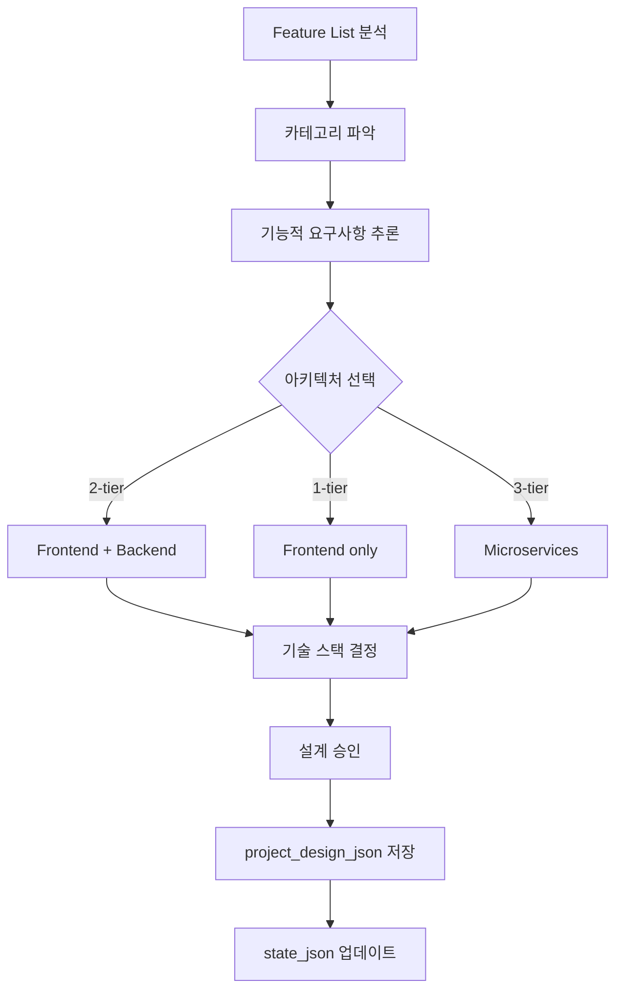
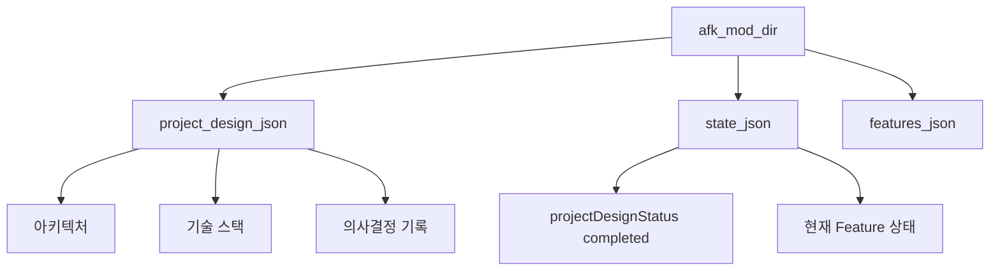

# 설치 및 시작하기

AFK-Mod 플러그인을 설치하고 첫 프로젝트를 시작하는 방법을 안내합니다.

## 설치


### 1. 마켓플레이스 추가

AFK-Mod가 포함된 마켓플레이스를 추가합니다:

```bash
/plugin marketplace add https://github.com/robinseo/afk-mod
```

### 2. 플러그인 설치

```bash
/plugin install afk-mod
```

### 3. 설치 확인

```bash
/help
```

`/afk:design`, `/afk:feature-list`, `/afk:start` 등의 명령어가 표시되면 설치 완료입니다.

## 팀 프로젝트에서 자동 설치

저장소 수준에서 구성하면 팀 멤버가 자동으로 플러그인을 설치받습니다.

### `.claude/settings.json` 설정

```json
{
  "plugins": [
    {
      "name": "afk-mod",
      "marketplace": "https://github.com/robinseo/afk-mod"
    }
  ]
}
```

팀 멤버가 저장소를 열면 플러그인이 자동으로 설치됩니다.

## 첫 프로젝트 시작



## Feature List 준비하기

### 옵션 1: CSV 파일 사용


**단계:**

1. `afk_mod_dir` 디렉토리 생성
```bash
mkdir .afk-mod
```

2. `feature_list_csv` 파일 복사
```bash
cp your-feature-list.csv .afk-mod/
```

3. `afk_design` 실행
```
/afk:design
# CSV를 자동으로 JSON으로 변환합니다
```

### 옵션 2: JSON 파일 사용


**단계:**

1. `afk_mod_dir` 디렉토리 생성
```bash
mkdir .afk-mod
```

2. `feature_list_json` 파일 복사
```bash
cp your-feature-list.json .afk-mod/
```

3. `afk_design` 실행
```
/afk:design
# 바로 프로젝트 설계를 시작합니다
```

### 옵션 3: 대화형으로 생성



```
/afk:design
```

클로드코드가 다음을 안내합니다:
1. 프로젝트 정보 입력 (이름, 설명)
2. Feature 카테고리 추가
3. 하위 Feature 추가
4. 상세 정보 입력 (User Action, System Outcome, Acceptance Criteria)

## 프로젝트 설계

```
/afk:design
```

### 설계 프로세스



### 설계 완료 후 생성되는 파일



## 다음 단계

- [명령어 상세 가이드](commands.md)
- [워크플로우 상세](workflow.md)
- [Feature List 형식](feature-list-format.md)
