# 워크플로우 상세

AFK-Mod의 전체 개발 워크플로우를 상세히 설명합니다.

## 6단계 TDD 워크플로우

AFK-Mod는 6단계 TDD 워크플로우를 따릅니다:

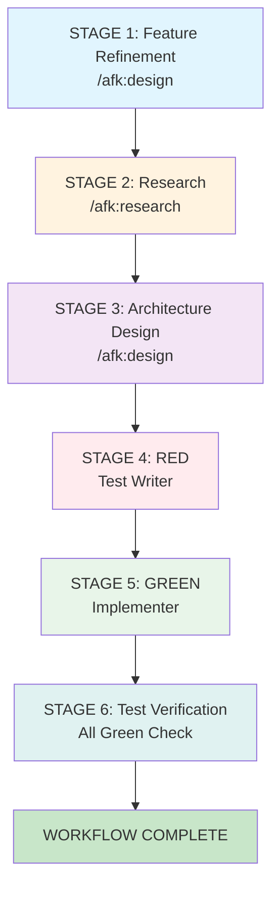

### STAGE 1: Feature Refinement

**명령어**: `/afk:design`

**Input**: 원본 요구사항
**Output**: 수락기준(AC) 포함 피처 명세서
**Gate**: 사용자 승인 필요

```
사용자> /afk:design

클로드코드> Feature 1.1.1: 이슈 생성

## 수락기준 (Acceptance Criteria)
AC1: 사용자는 제목, 설명, 우선순위, 담당자를 입력하여 이슈를 생성할 수 있다
AC2: 제목이 비어있으면 ValidationError가 발생한다
AC3: 설명이 비어있으면 ValidationError가 발생한다

승인하시겠습니까?
1. Accept
2. Decline
```

### STAGE 2: Research

**명령어**: `/afk:research <feature-id>`

**Output**: 리서치 보고서
- 프로젝트 구조 파악
- 기존 코드 패턴 분석
- 의존성 및 기술 스택 확인
- 구현 난이도 평가

```
사용자> /afk:research 1.1.1

클로드코드> ## STAGE 2: RESEARCH

### 프로젝트 구조 분석
- 현재 파일: web/src/services/, api/app/api/
- 관련 컴포넌트: IssueForm, IssueList, IssueService

### 기존 코드 패턴
- Service Layer: API 호출은 Service 클래스에서 담당
- State: React Query로 서버 상태 관리
- Error: ValidationError 커스텀 클래스 사용
- Testing: Vitest (Frontend), Pytest (Backend)

### 구현 난이도 평가
- 복잡도: 중간
- 예상 소요 시간: 2시간
- 선행 작업: 없음

### 추천 접근 방식
1. 기존 IssueService 확장
2. 테스트는 web/src/services/__tests__/에 작성
3. API 엔드포인트는 api/app/api/issues/에 추가

✅ Research 완료. 이제 /afk:start 1.1.1로 TDD를 시작하세요.
```

### STAGE 3: Architecture Design

**명령어**: `/afk:design`

**Output**: 2~4개 아키텍처 옵션
- 각 옵션별 장단점
- 비교 매트릭스
- 추천 옵션

**Gate**: 사용자 아키텍처 선택

```
사용자> /afk:design

클로드코드> ## 아키텍처 옵션

### Option 1: 2-tier (Frontend + Backend + Database)
- 장점: 관리 용이, 팀 분업 용이
- 단점: 네트워크 지연

### Option 2: 1-tier (Frontend only + Local Storage)
- 장점: 빠른 프로토타이핑
- 단점: 확장성 제한

### Option 3: 3-tier (Frontend + API Gateway + Backend + Database)
- 장점: 확장성, 보안
- 단점: 복잡도 증가

어떤 아키텍처를 선택하시겠습니까?
```

### STAGE 4: TEST CASE (RED Phase)

**명령어**: `/afk:start <feature-id>`

- 구현 전에 테스트 먼저 작성
- 모든 테스트가 실패해야 함 (RED)

```
클로드코드> ## RED 단계: 테스트 작성

Test Writer Agent가 테스트를 작성합니다.

테스트 케이스 정의:
- 정상 입력으로 이슈 생성 성공
- 빈 제목으로 이슈 생성 시도 → ValidationError
- 빈 설명으로 이슈 생성 시도 → ValidationError

`src/services/__tests__/IssueService.test.ts` 생성 완료

테스트 실행 결과:
\```
FAIL src/services/__tests__/IssueService.test.ts
  IssueService.createIssue
    ✗ should create an issue with valid input
      ReferenceError: IssueService is not defined
\```

✓ RED 단계 완료: 테스트가 예상대로 실패했습니다.
```

### STAGE 5: IMPLEMENTATION (GREEN Phase)

**명령어**: `/afk:start <feature-id>` (자동 진행)

- 테스트를 통과시키는 최소한의 코드 작성
- 점진적 구현

```
클로드코드> ## GREEN 단계: 최소 구현

Implementer Agent가 최소 구현을 작성합니다.

테스트 실행 결과:
\```
PASS src/services/__tests__/IssueService.test.ts
  ✓ should create an issue with valid input
  ✓ should throw error when title is empty
  ✓ should throw error when title contains only whitespace
  ✓ should throw error when description is empty
\```

✓ GREEN 단계 완료: 모든 테스트 통과
```

### STAGE 6: TEST VERIFICATION

**명령어**: `/afk:start <feature-id>` (자동 진행)

- 전체 테스트 스위트 실행
- ALL GREEN 확인
- 실패 시 Stage 5로 회귀 (최대 3회)

```
클로드코드> ## TEST VERIFICATION

전체 테스트 스위트 실행 결과:
\```
PASS src/services/__tests__/IssueService.test.ts
PASS src/components/__tests__/IssueForm.test.ts
PASS api/tests/test_issues.py

All tests passed! (15/15)
\```

✓ TEST VERIFICATION 완료: ALL GREEN 확인
```

### Human-in-the-Loop 지점

```
AFK-Mod 6단계 워크플로우:
1. AC 승인 (/afk:design) ✓
2. Research 완료 (/afk:research) ✓
3. 아키텍처 선택 (/afk:design) ✓
4. RED → GREEN → REFACTOR (자동 진행)
5. Task 완료 승인 (/afk:start) ✓
```

## 전체 워크플로우

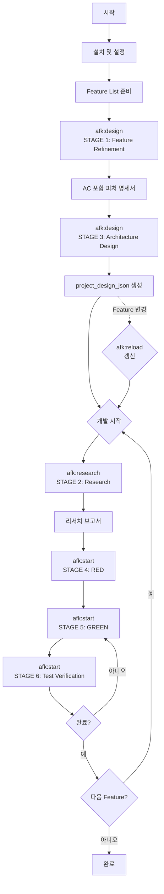

## Phase 1: 준비 단계

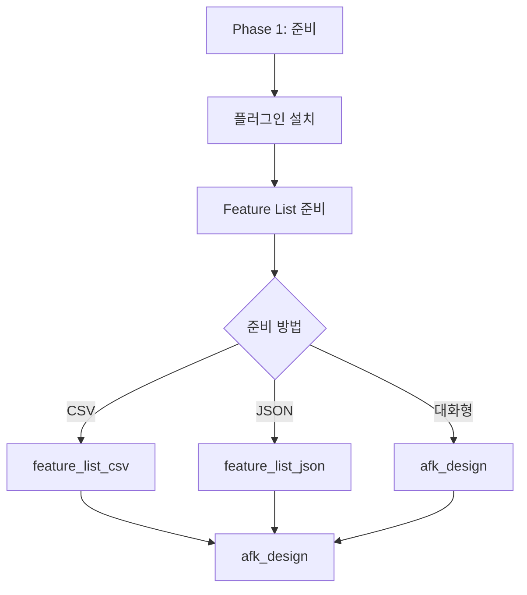

### 1.1 플러그인 설치

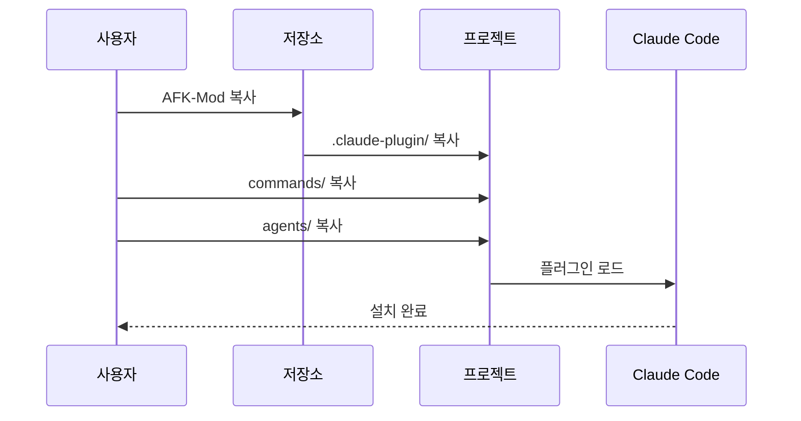

### 1.2 Feature List 준비

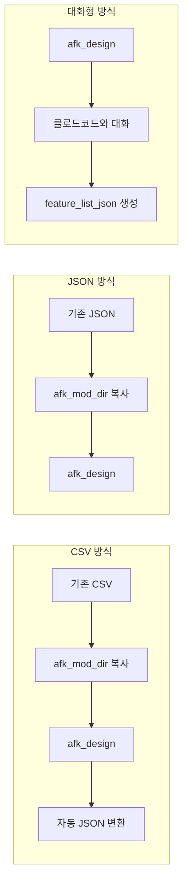

## Phase 2: 설계 단계

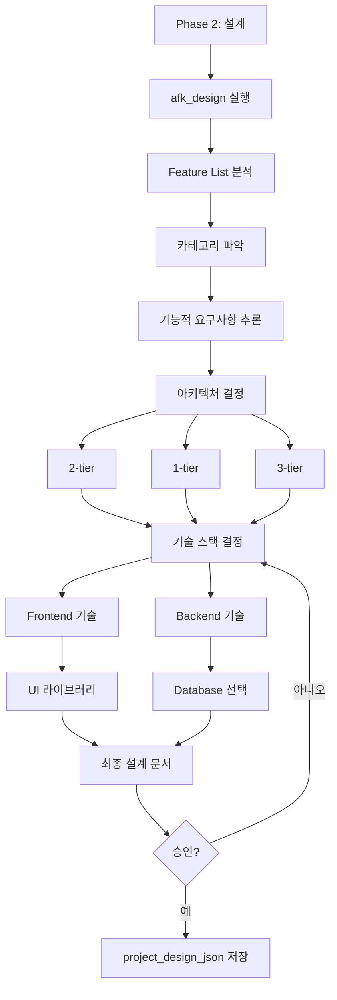

### 2.1 설계 프로세스 상세

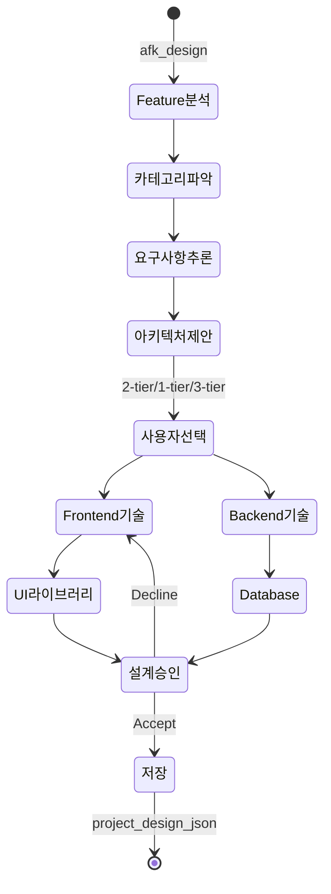

## Phase 3: 개발 단계 (6단계 TDD 워크플로우)

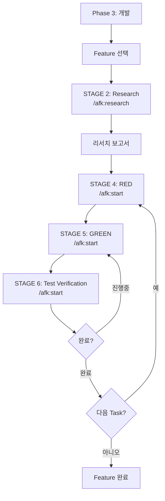

### 3.1 단순 Feature vs 복잡 Feature

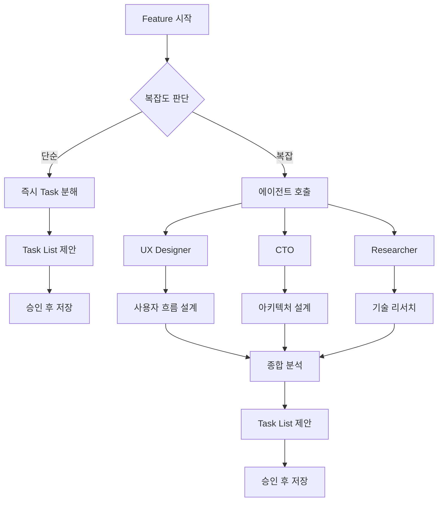

### 3.2 Task 실행 흐름

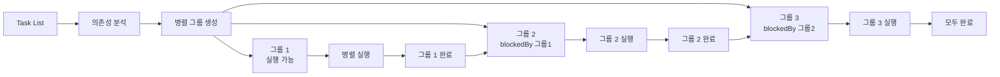

## Phase 4: 관리 단계

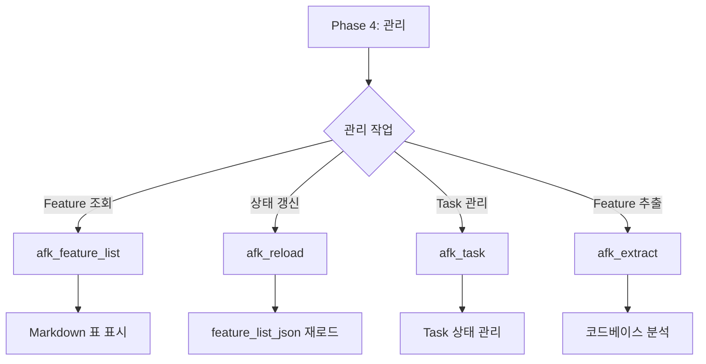

## 반복 워크플로우

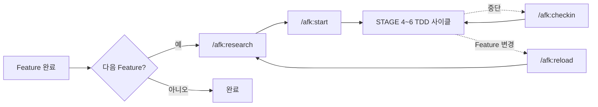

## 에이전트 협업 워크플로우

6단계 TDD 워크플로우에서 에이전트 간 협업 흐름입니다.

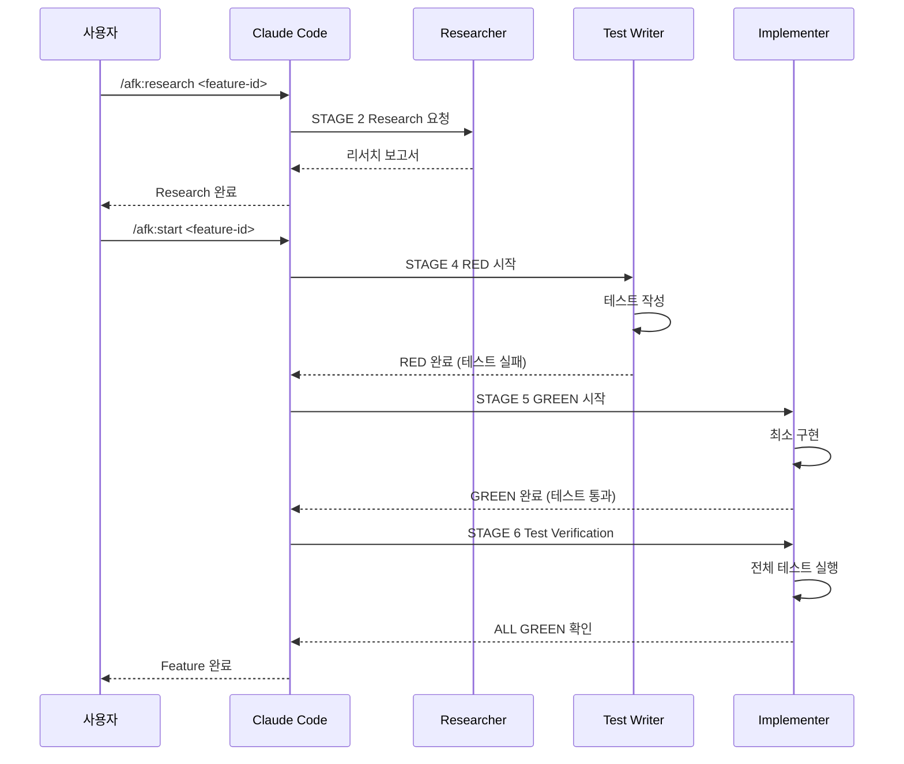

## 상태 관리 워크플로우

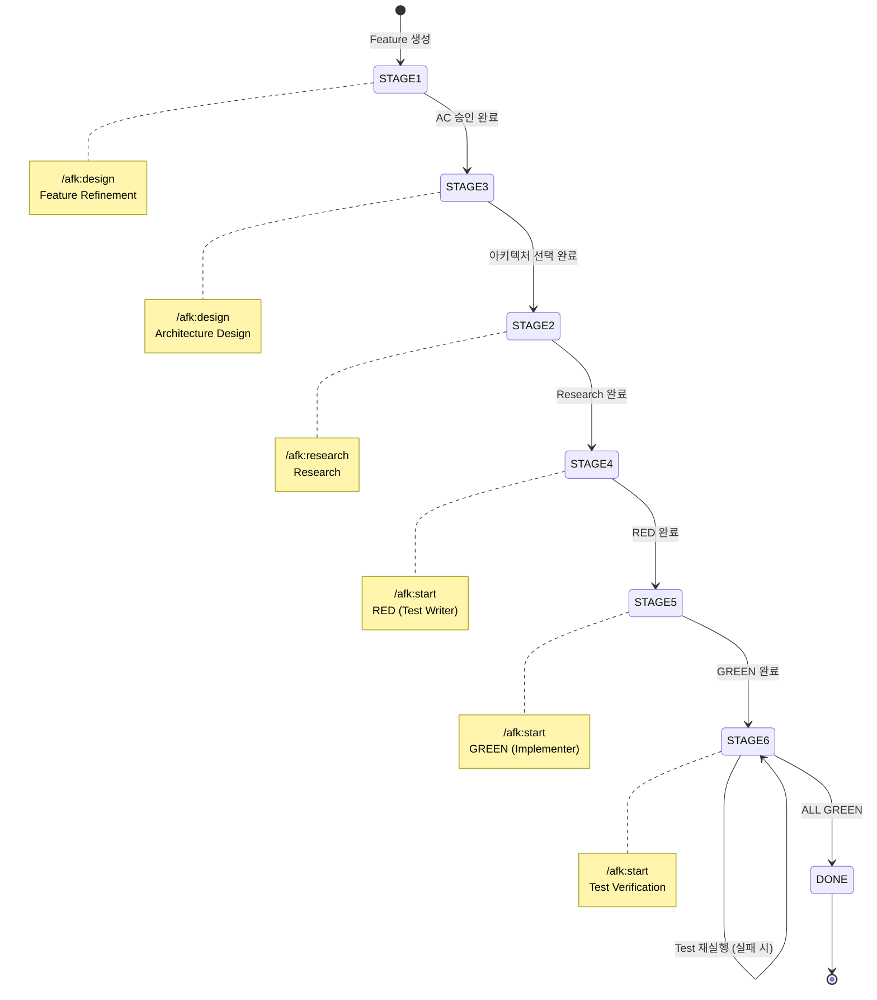

## 세션 재개 워크플로우

사용자가 중간에 작업을 중단했다가 다시 돌아왔을 때의 워크플로우입니다.

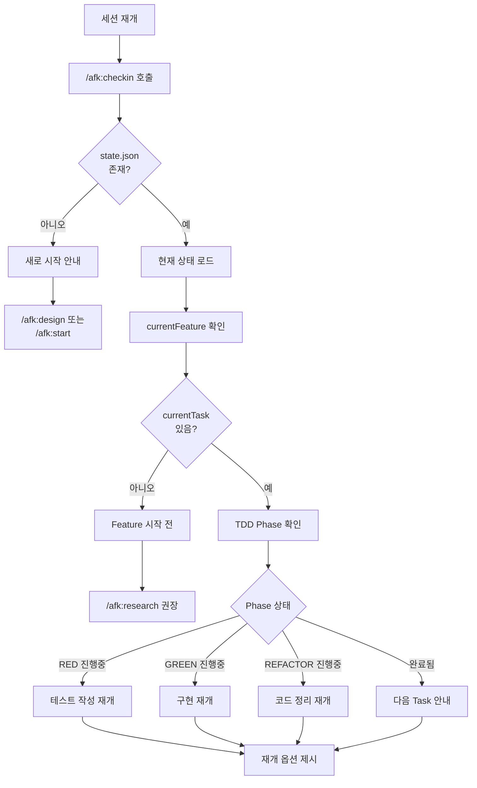

### /afk:checkin 사용 시나리오

```
[첫 번째 세션 - 작업 진행 중]
사용자> /afk:start 1.1.1
... TDD 사이클 진행 ...
[중단 - 작업 중이던 REFACTOR 단계]

[두 번째 세션 - 재접속 후]
사용자> /afk:checkin

클로드코드> 👋 다시 오셨군요!

## 📊 현재 작업 중
### Feature 1.1.1: 이슈 생성
**Task 1**: REFACTOR 진행 중

## 🚀 다음 단계
1. 계속하기 - REFACTOR 완료
2. 검토하기 - 현재 코드 확인
```

### /afk:start 재진입 감지

```
사용자> /afk:start 1.1.1

클로드코드> ⚠️ 이 Feature는 이미 진행 중입니다.

## 현재 상태
- Task 1: REFACTOR 단계 진행 중
- 마지막 작업: 코드 정리 진행

어디서부터 다시 시작할까요?
1. 중단된 지점부터 계속
2. 처음부터 다시 시작
3. 취소
```

