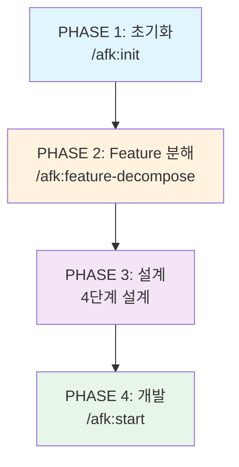
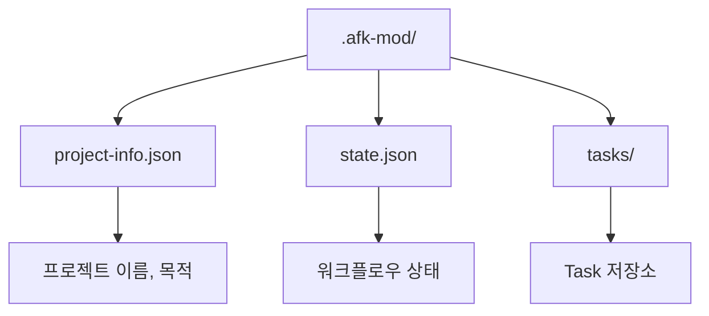
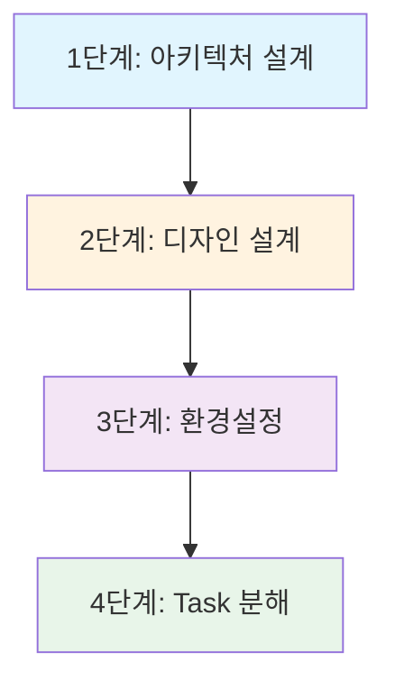
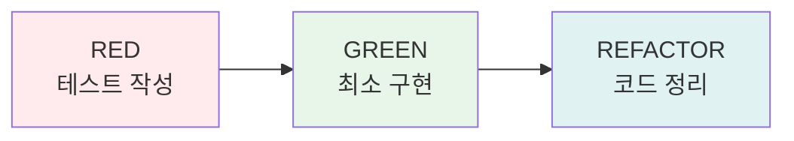
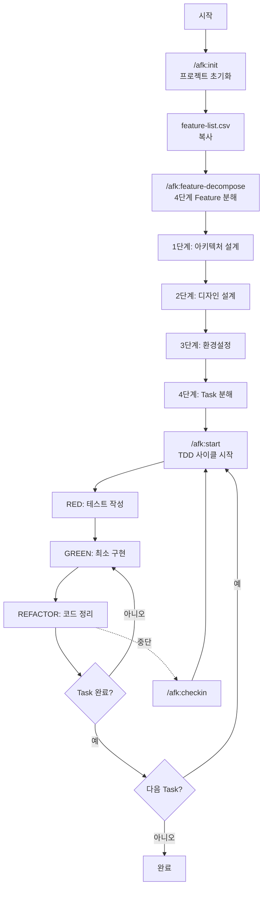
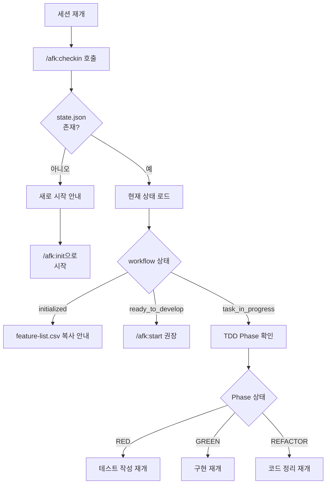
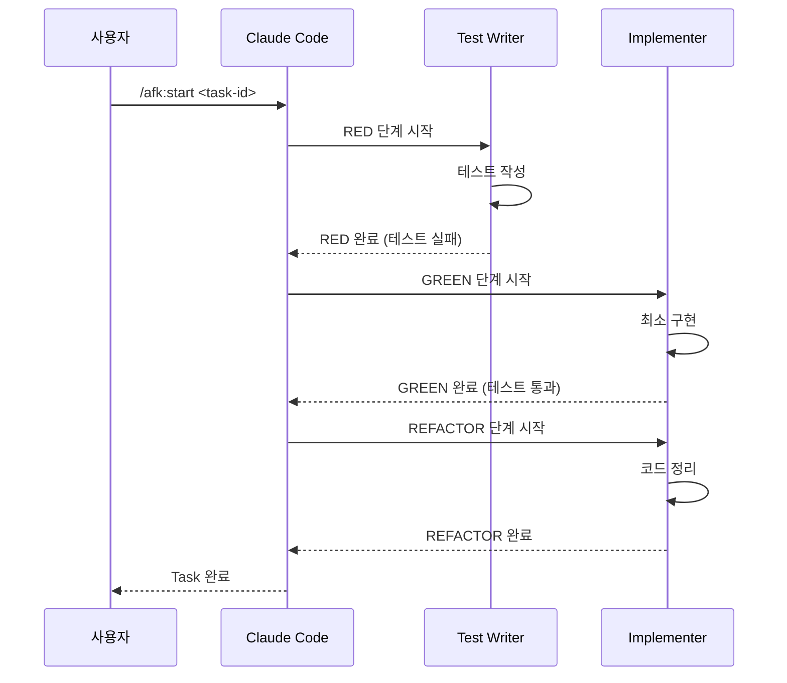
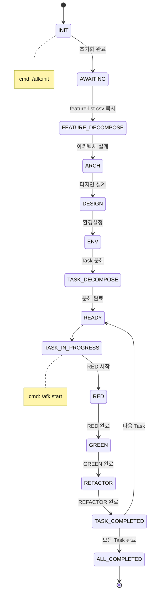

# 워크플로우 상세

AFK의 전체 개발 워크플로우를 상세히 설명합니다.

## 4단계 워크플로우

AFK는 4단계 워크플로우를 따릅니다:



## PHASE 1: 초기화

**명령어**: `/afk:init`

프로젝트를 초기화하고 `.afk-mod/` 디렉토리를 생성합니다.

### 생성되는 파일



### 사용 예시

```
사용자> /afk:init

클로드코드> AFK 프로젝트를 초기화합니다.

프로젝트 정보를 입력해주세요:

1. **프로젝트 이름**: my-awesome-app
2. **프로젝트 목적**: 사용자가 이슈를 추적할 수 있는 웹 애플리케이션

✅ 초기화 완료!

## 생성된 파일
- .afk-mod/project-info.json
- .afk-mod/state.json
- .afk-mod/tasks/

## 다음 단계
1. feature-list.csv를 .afk-mod/에 복사하세요
2. /afk:feature-decompose를 실행하세요
```

---

## PHASE 2: Feature 분해

**명령어**: `/afk:feature-decompose`

Feature를 4단계 프로세스로 분해하여 Task로 변환합니다.

### 4단계 프로세스



#### 1단계: 아키텍처 설계

사용자와 핑퐁하면서 기술 아키텍처를 결정합니다.

**질문 항목:**

1. **데이터베이스**: PostgreSQL, MySQL, MongoDB, SQLite?
2. **실시간 기능**: WebSocket/SSE 필요 여부
3. **인증/인가**: JWT, OAuth, Session?
4. **API 스타일**: REST, GraphQL, tRPC?
5. **배포 환경**: Vercel, AWS, Docker?
6. **외부 서비스**: 사용할 API나 서비스
7. **아키텍처 패턴**: Monolith, Microservices, Serverless?

**결과물:** `.afk-mod/architecture-design.md`

#### 2단계: 디자인 설계

UI/UX 디자인을 설계합니다.

**질문 항목:**

1. **디자인 시스템**: shadcn/ui, Chakra UI, Material UI, Tailwind CSS?
2. **다크 모드**: 지원 여부
3. **모바일 지원**: 반응형, PWA?
4. **색상 테마**: 브랜드 색상
5. **레이아웃 스타일**: 사이드바, 탭, 카드?
6. **애니메이션**: 사용 정도

**결과물:** `.afk-mod/design-design.md`

#### 3단계: 환경설정

개발 환경을 설정합니다.

**질문 항목:**

1. **언어**: TypeScript, JavaScript, Python?
2. **프레임워크**: React, Next.js, Vue, Express, FastAPI?
3. **패키지 매니저**: npm, yarn, pnpm, bun?
4. **테스트 도구**: Jest, Vitest, Playwright, Cypress?
5. **코드 품질**: ESLint, Prettier, Biome?
6. **CI/CD**: GitHub Actions, GitLab CI?

**결과물:** `.afk-mod/environment-setup.md`

#### 4단계: Task 분해

Feature를 fine-grained Task로 분해하고 그룹화합니다.

**Task 분해 전략:**

- 각 Task는 30분 ~ 2시간 내 완료 가능
- 관련 Task는 같은 그룹 (최대 5-7개)
- 넘버링: Feature ID 기반 (예: 1.1.1.1)
- 의존성: blockedBy 명시

**결과물:**

- `.afk-mod/tasks/task-groups.json` - 전체 Task 그룹 구조
- `.afk-mod/tasks/tg-*.json` - 각 Task 그룹별 상세 Task

---

## PHASE 3: TDD 사이클

**명령어**: `/afk:start <task-id>`

Task를 시작하고 TDD 사이클을 실행합니다.

### RED → GREEN → REFACTOR



### RED 단계

Test Writer Agent가 테스트를 작성합니다.

````
## RED 단계: 테스트 작성

테스트 케이스 정의:
- 정상 입력으로 이슈 생성 성공
- 빈 제목으로 ValidationError
- 빈 설명으로 ValidationError

`src/components/__tests__/LoginForm.test.tsx` 생성 완료

테스트 실행 결과:
```
FAIL src/components/__tests__/LoginForm.test.tsx
  ✗ should render login button
    ReferenceError: LoginForm is not defined
```

✓ RED 단계 완료: 테스트가 예상대로 실패했습니다.
````

### GREEN 단계

Implementer Agent가 최소 구현을 작성합니다.

````
## GREEN 단계: 최소 구현

테스트 실행 결과:
```
PASS src/components/__tests__/LoginForm.test.tsx
  ✓ should render email input field
  ✓ should render password input field
  ✓ should render login button
```

✓ GREEN 단계 완료: 모든 테스트 통과
````

### REFACTOR 단계

Implementer Agent가 코드를 정리합니다.

````
## REFACTOR 단계: 코드 정리

리팩토링 항목:
1. 타입 정의 추가
2. 이벤트 핸들러 분리
3. 스타일 분리

테스트 실행 결과:
```
PASS src/components/__tests__/LoginForm.test.tsx
  ✓ 모든 테스트 통과
```

✓ REFACTOR 단계 완료: 테스트 통과 유지
````

---

## Human-in-the-Loop 지점

```
AFK 워크플로우:
1. 초기화 (/afk:init) ✓
2. Feature 분해 (/afk:feature-decompose) ✓
   - 아키텍처 설계 (사용자 승인)
   - 디자인 설계 (사용자 승인)
   - 환경설정 (사용자 승인)
   - Task 분해 (사용자 승인)
3. RED → GREEN → REFACTOR (자동 진행)
4. Task 완료 후 다음 Task 승인
```

---

## 전체 워크플로우



---

## 세션 재개 워크플로우

중간에 작업을 중단했다가 다시 돌아왔을 때:



### /afk:checkin 사용 예시

````
[첫 번째 세션 - 작업 진행 중]
사용자> /afk:start 1.1.1
... TDD 사이클 진행 ...
[중단 - REFACTOR 단계]

[두 번째 세션 - 재접속 후]
사용자> /afk:checkin

클로드코드> 👋 다시 오셨군요!

## 📊 현재 작업 중
### Task 1.1.1: 로그인 폼 UI 구현
**TDD Phase**: 🔄 REFACTOR 진행 중

## 🚀 다음 단계
1. 계속하기 - REFACTOR 완료
2. 검토하기 - 현재 코드 확인
````

---

## 에이전트 협업 워크플로우



---

## 상태 관리 워크플로우


