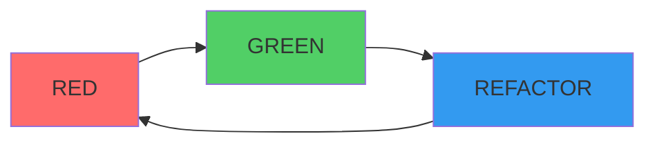
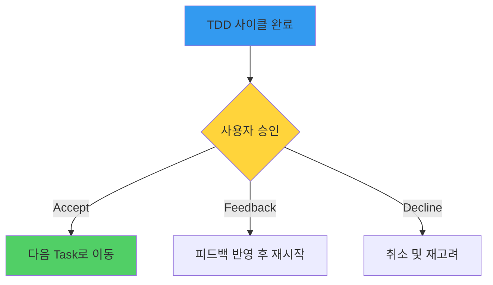

# TDD Cycle

> **NOTE**: 이 파일의 모든 코드 예시와 설명은 **Issue Tracker 프로젝트**를 기반으로 한 예시입니다.
> 실제 사용 시, 프로젝트의 도메인과 요구사항에 맞게 용어와 구조를 수정하여 적용하세요.

Test-Driven Development의 Red-Green-Refactor 사이클을 따릅니다.

## TDD 사이클



## 1. RED: 실패하는 테스트 작성

> **예시: Issue Tracker 프로젝트**

### 원칙
- **항상** 테스트를 먼저 작성합니다
- 테스트가 **실패**하는 것을 확인합니다 (에러가 아니라 실패)
- 최소한의 테스트로 시작합니다

### 절차

```typescript
// 1. 테스트 파일 생성 (또는 기존 파일에 테스트 추가)

// 2. 실패할 테스트 작성
describe('IssueService.createIssue', () => {
  it('should create an issue with valid input', async () => {
    const result = await issueService.createIssue({
      title: 'Test Issue',
      description: 'Test Description',
      priority: 'normal',
    });

    expect(result.id).toBeDefined();
    expect(result.title).toBe('Test Issue');
  });
});

// 3. 테스트 실행 → 실패 확인
// (함수가 아직 없거나, 구현이 안 되어 있음)
```

### 확인 사항
- [ ] 테스트가 실행됨
- [ ] 테스트가 **실패**함 (에러가 아님)
- [ ] 실패 이유가 명확함 ("undefined is not a function" 등)

---

## 2. GREEN: 테스트 통과 구현

> **예시: Issue Tracker 프로젝트**

### 원칙
- **최소한의 코드**만 작성하여 테스트를 통과합니다
- 완벽한 구현이 아니어도 됨
- 테스트를 통과하는 것이 목표

### 절차

```typescript
// 최소한의 구현으로 테스트 통과
export class IssueService {
  async createIssue(data: CreateIssueInput) {
    // Backend 연동은 아직 안 함
    return {
      id: 'mock-id-' + Date.now(),
      title: data.title,
      status: 'open',
    };
  }
}
```

### 확인 사항
- [ ] 테스트가 **통과**함
- [ ] 구현이 최소한임
- [ ] 불필요한 코드 없음

---

## 3. REFACTOR: 코드 정리

> **예시: Issue Tracker 프로젝트**

### 원칙
- 테스트가 **계속 통과**하는 상태를 유지합니다
- 코드를 읽기 쉽고 유지보수하기 쉽게 만듭니다
- 새로운 기능을 추가하지 않습니다

### 절차

```typescript
// 리팩토링: 실제 Backend 연동, 에러 처리 추가
export class IssueService {
  constructor(
    private apiClient: ApiClient,
    private cache: IssueCache
  ) {}

  async createIssue(data: CreateIssueInput) {
    // 1. 입력 검증
    this.validateInput(data);

    // 2. Backend API 호출
    const issue = await this.apiClient.post('/issues', {
      title: data.title,
      description: data.description,
      priority: data.priority,
    });

    // 3. 캐시 업데이트
    this.cache.invalidate();

    return {
      id: issue.id,
      title: issue.title,
      status: issue.status,
    };
  }

  private validateInput(data: CreateIssueInput): void {
    if (!data.title || data.title.trim().length === 0) {
      throw new ValidationError('Title is required');
    }
    if (!data.description || data.description.trim().length === 0) {
      throw new ValidationError('Description is required');
    }
  }
}
```

### 확인 사항
- [ ] 테스트가 여전히 **통과**함
- [ ] 코드가 더 읽기 쉬워짐
- [ ] 중복이 제거됨
- [ ] 적절한 이름이 사용됨

---

## 사이클 완료 후



사이클이 완료되면 사용자에게 보고합니다:

```
클로드코드> TDD 사이클을 완료했습니다.

## RED: 이슈 생성 테스트 작성 ✓
- describe('IssueService.createIssue', ...) 작성
- 테스트 실행: PASS → FAIL (예상대로 실패)

## GREEN: 최소 구현 ✓
- IssueService.createIssue() 메서드 생성
- 테스트 실행: PASS

## REFACTOR: 코드 정리 ✓
- Backend API 연동
- 입력 검증 로직 추가 (제목, 설명 필수)
- 에러 처리 추가
- 캐시 무효화 로직 추가
- 테스트 실행: PASS (여전히 통과)

## 결과
- 테스트: 1개 통과
- 구현: IssueService.createIssue() 완료
- 커버리지: 목표 도달

다음 단계로 넘어갈까요?
1. Accept - 다음 Task로
2. Refactor 더 하기
3. (의견 입력)
```

---

## TDD 가이드라인

### DO ✅
- 작은 단위로 진행
- 테스트마다 하나의 것만 검증
- 명확한 테스트 이름 사용
- Edge case 테스트 추가

### DON'T ❌
- 한 번에 여러 테스트 작성하지 않기
- 구현을 먼저하지 않기
- 테스트를 건너뛰지 않기
- GREEN 상태에서 리팩토링하지 않기

---

## 테스트 예제

> **예시: Issue Tracker 프로젝트**

### 단위 테스트

```typescript
describe('IssueService.validateInput', () => {
  it('should throw error when title is empty', () => {
    const service = new IssueService(mockApi, mockCache);

    expect(() => {
      service.createIssue({ title: '', description: 'Valid' });
    }).toThrow(ValidationError);
  });

  it('should throw error when description is empty', () => {
    const service = new IssueService(mockApi, mockCache);

    expect(() => {
      service.createIssue({ title: 'Valid', description: '' });
    }).toThrow(ValidationError);
  });

  it('should accept valid input', () => {
    const service = new IssueService(mockApi, mockCache);

    expect(() => {
      service.createIssue({
        title: 'Valid Issue',
        description: 'Valid Description',
      });
    }).not.toThrow();
  });
});
```

### 통합 테스트

```typescript
describe('POST /issues', () => {
  it('should create issue and return 201', async () => {
    const response = await fetch('/api/issues', {
      method: 'POST',
      headers: { 'Content-Type': 'application/json' },
      body: JSON.stringify({
        title: 'Integration Test Issue',
        description: 'Test Description',
        priority: 'normal',
      }),
    });

    expect(response.status).toBe(201);
    const data = await response.json();
    expect(data.id).toBeDefined();
  });
});
```

---

## 진척도 추적

각 Task의 TDD 진척도:

| 단계 | 상태 | 비고 |
|------|------|------|
| RED | ⬜ | 실패하는 테스트 작성 |
| GREEN | ⬜ | 최소 구현 |
| REFACTOR | ⬜ | 코드 정리 |
| APPROVED | ⬜ | 사용자 승인 |
